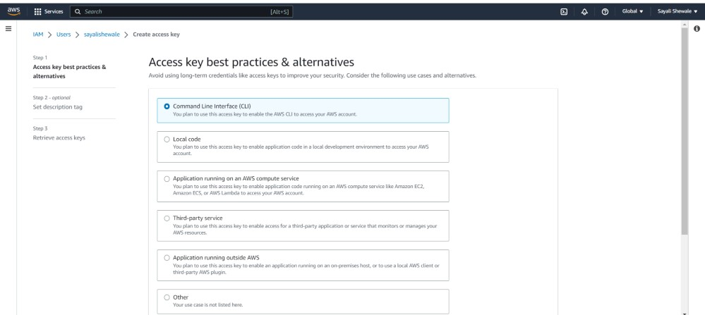
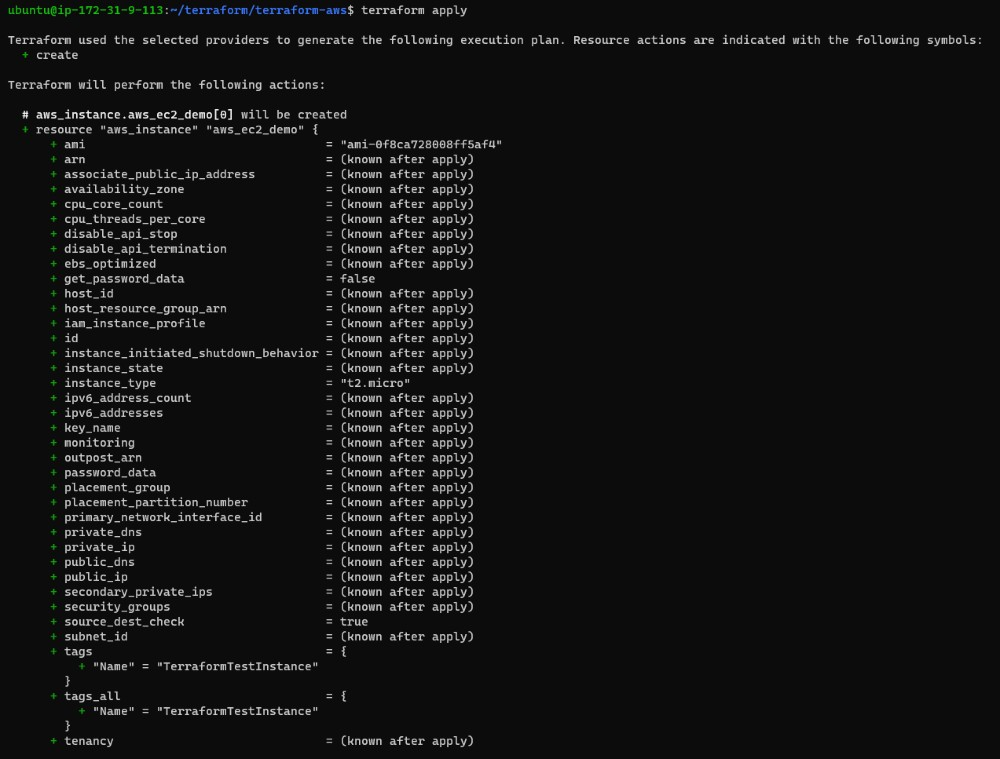

## Terraform create EC2 Instance

### AWS CLI installed
The AWS Command Line Interface (AWS CLI) is a unified tool to manage your AWS services. With just one tool to download and configure, you can control multiple AWS services from the command line and automate them through scripts.
1. Create an EC2 instance.
2. SSH into EC2 instance
3. Install AWS CLI

Run,

    sudo apt install awscli

Check aws cli version

### AWS IAM user
IAM (Identity Access Management) AWS Identity and Access Management (IAM) is a web service that helps you securely control access to AWS resources. You use IAM to control who is authenticated (signed in) and authorized (has permissions) to use resources.

Create IAM user.

Create Access key for IAM user.

Click on 'Create access key'

Select 'command line interface'

In order to connect your AWS account and Terraform, you need the access keys and secret access keys exported to your machine.

    export AWS_ACCESS_KEY_ID=<access key>
    export AWS_SECRET_ACCESS_KEY=<secret access key>

### Install required providers

    terraform {
     required_providers {
            aws = {
            source  = "hashicorp/aws"
            version = "~> 4.16"
    }
    }
            required_version = ">= 1.2.0"
    }

The **terraform** block defines the version of Terraform that is required to execute this configuration. In this case, it specifies that the Terraform version must be >= **1.2.0**.

The **required_providers** block declares the AWS provider and its version that Terraform will use for the resources defined in this configuration. In this case, it declares the AWS provider with the source **hashicorp/aws** and specifies that the version of the provider should be **~> 4.16**, which means any version of the AWS provider greater than or equal to 4.16 and less than 5.0 will be acceptable.
Add the region where you want your instances to be

    provider "aws" {
    region = "ap-south-1"
    }

Provision an AWS EC2 instance using Terraform

    resource "aws_instance" "aws_ec2_demo" {
            count = 2
            ami = "ami-0f8ca728008ff5af4"
            instance_type = "t2.micro"
            tags = {
                Name = "TerraformTestInstance"
      }
    }

The resource block has a resource type of "aws_instance" and a resource name of "aws_ec2_demo". The count parameter is set to 2, which means that two instances will be created.

The ami parameter specifies the Amazon Machine Image (AMI) to use for the instances. In this case, the AMI ID is "ami-0f8ca728008ff5af4".

The instance_type parameter specifies the type of instance to create. In this case, the instance type is "t2.micro".

The tags parameter specifies metadata to attach to the instance, in this case, a tag named "Name" with the value "TerraformTestInstance".

first initialize the working directory with the necessary plugins and modules by executing **terraform init**

It will create an execution plan by analyzing the changes required to achieve the desired state of your infrastructure with **terraform plan**

Finally, it will apply the changes to create or update resources as needed with **terraform apply**.

You can check two instances created using terraform.

