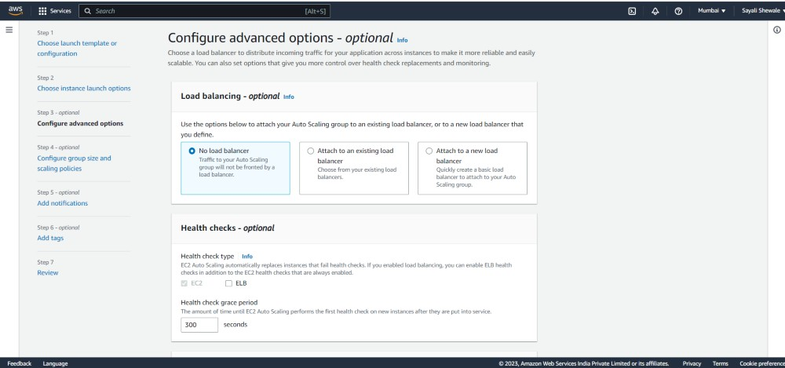

# Auto scaling EC2 with Cloudwatch
Launch your EC2 instance

When the instance has stated running, tick on the instance, click on the `Action` drop down

Select `Image and template` and click on `create template from instance`

On the `Launch template name`, add a name to the template

You may also give a description(Optional)

Click `Create launch template`

Scroll down, Click on the `Create Auto Scaling group` button to start the creation process.

Give the Auto scaling group a name

Select the launch template to use for the instances in the group.

Choose the instance type and other configuration details such as VPC, subnet, security groups, and storage.

If you have a load balancer you can add it and it's target group by ticking `Attach to an existing load balancer`

Scroll down and click `Next`

Set up the scaling policies to determine when to launch new instances. configure desired, minimum and maximum capacity of instance.

Select `Target tracking scaling policy` and choose `metric type` to CPU utilization which will create an alarm.

Set a Target value for the server

Click on `Create auto scaling group`

Auto-scaling group is created.

### Use Amazon CloudWatch to monitor the performance of the Auto Scaling group and the EC2 instances and troubleshoot any issues that arise.

Once the alarm is set up, it will start monitoring the specified metric for the Auto Scaling group.

If the metric exceeds the threshold that you have set, the alarm will be triggered and take the action that you have specified.

Target tracking policy in autoscaling create 2 alarms with 2 different conditions.

Go to auto-scaling group that we created, Click on the `Monitoring` tab and enable `Auto scaling group metric`

You can create alarm by going to CloudWatch dashboard.

Click on the `Create Alarm` button to set up an alarm.

Click on `Select metric`

Click on "EC2".

Click on 'By Auto Scaling Group'.

Choose the metric you want to monitor. You can search for the metric by name.
Choose `CPUUtilisation`

Click `Select a single metric to continue`

Once the alarm is created, it will start monitoring the specified metric and trigger the configured action if the conditions are met. You can view the status of the alarm in the CloudWatch console, and manage and update the alarm settings as needed.
