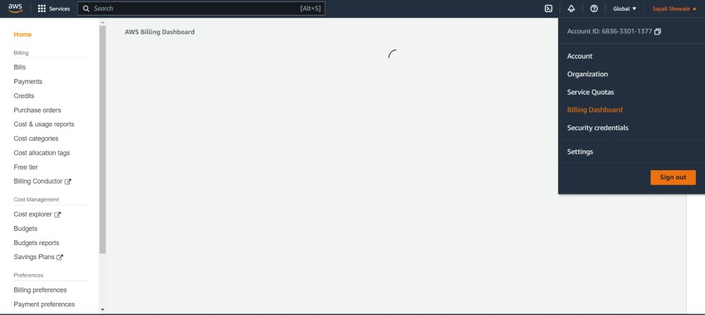

## Set up CloudWatch alarms and SNS topic in AWS

#### What is Amazon CloudWatch?
Amazon CloudWatch monitors your Amazon Web Services (AWS) resources and the applications you run on AWS in real time. You can use CloudWatch to collect and track metrics, which are variables you can measure for your resources and applications.

#### What is Amazon SNS?
Amazon Simple Notification Service is a notification service provided as part of Amazon Web Services since 2010. It provides a low-cost infrastructure for mass delivery of messages, predominantly to mobile users.

#### Task :
Create a CloudWatch alarm that monitors your billing and send an email to you when a it reaches $2.

#### To enable the monitoring of estimated charges
Open the AWS Billing console at https://console.aws.amazon.com/billing/.

In the navigation pane, choose Billing Preferences.

Choose Receive Billing Alerts.

Choose Save preferences.

#### Creating a billing alarm

Open the CloudWatch console

In the navigation pane, choose Alarms, and then choose All alarms.

Choose Create alarm.

Choose Select metric.

In Browse, choose Billing, and then choose Total Estimated Charge.

Select the box for the EstimatedCharges metric, and then choose Select metric.

For Statistic, choose Maximum.

For Period, choose 6 hours.

For Threshold type, choose Static.

For Whenever EstimatedCharges is, choose Greater.

define a threshold value that triggers your alarm. here threshold value is 2$.

Under Notification, specify an Amazon SNS topic to be notified when your alarm is in the ALARM state.

You can select an existing Amazon SNS topic or create a new Amazon SNS topic by selecting 'Create new topic'.

If you want your alarm to send multiple notifications for the same alarm state or for different alarm states, 

choose Add notification.

choose Next.

Under Name and description, enter a name for your alarm.

Under Preview and create, make sure that your configuration is correct, and then choose Create alarm.

billing alarm is created.

