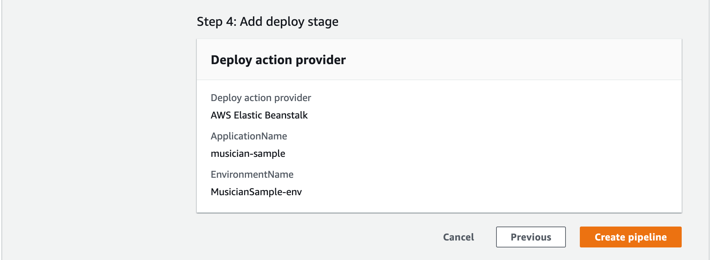

## Deploying a NodeJS application from GitHub to AWS Elastic Beanstalk and creating a CI/CD AWS CodePipeline.

**What is Elastic Beanstalk?**

Using Elastic Beanstalk you will be able to deploy and manage applications within the AWS Cloud without having knowledge about the infrastructure that execute those applications. Elastic Beanstalk reduces management complexness without proscribing selection or control. You just transfer your application and Elastic Beanstalk mechanically handles the main points of capability provisioning, load equalization, scaling and application health observance.

Elastic Beanstalk support applications developed in java, Go, PHP, NodeJS, Python and Ruby. Once you deploy your application, Elastic Beanstalk build the chosen supported platform version and provisions one or additional AWS resources like AmazonEC2 instances, to run your application. Elastic Beanstalk has a default security group, this security group acts as a firewall for the instances.

Elastic Beanstalk console is used to interact with Elastic Beanstalk. You can also use AWS Command line interface or high-level designed interface.

Once you create and deploy application, information about your application can be available on Elastic Beanstalk console.

**Why Elastic Beanstalk?**
AWS Elastic Beanstalk makes it easy for developers to share their application across different devices within less amount of time.

**Pre-Requisities**

We will need pre-built sample of NodeJS application. You should also have GitHub account and AWS account.

Click [here](https://us-west-2.console.aws.amazon.com/console/home?region=us-west-2), to Create AWS Account and enter AWS User name and Password and it will open AWS Management Console page. Click on **All services** and choose **AWS Elastic Beanstalk**.

**Figure 1: AWS Management console**

When you click on **Elastic Beanstalk** , you will be directed to AWS Elastic Beanstalk Dashboard page and click **Create Application** button and configure your NodeJS application.

**Figure 2: AWS Elastic Beanstalk Dashboard page**

## To create an Application
You can use **Create Web app** console wizard to create your sample application.

1. Specify your Elastic Beanstalk application name information e.g: musician-sample
2. Click on Platform drop-down and select your platform e.g: node.js. Platform branch and platform version will be auto populated.
3. Select the Sample Application as application code and click on “Create Application “ button. It will take few minutes to launch your application.

**Figure 3: Creating a Web App Information page**

This will deploy your application in specific environment and tracks the progress and display events.

Once your Application is successfully launched , you will see Green check mark.

The environment Overview page will display high level of environment information such as Environment Health, Application running version and Application platform version where application is running on.

**Figure 4: Environment overview page**

On top of the Overview Page you will see the environment’s URL below the environment name, click on this URL to get to the sample application’s Congratulations Page.

Once your application is successfully deploy, we will set up a Continuous Integration and Continuous Delivery (CI/CD) AWS pipeline using AWS Code Pipeline Service. AWS Code pipeline services helps you to Build, Tests and Deploy code when there is any code changes in your source code.

We will learn how to create a simple pipeline that pulls code from GitHub repository and automatically deploy to AWS EC2 instances.

Click on **Service** dropdown and Select **CodePipeline** as shown in below picture OR you can also search **CodePipeline** in search bar.

**Figure 5: AWS Service page**

On CodePipeline Dashboard page choose **Create Pipeline**. Click on **Get started** for the first time user.

**Figure 6: Create pipeline page**

## Choose Pipeline settings
AWS source resources you created must be in same region as your pipeline.

1. In Pipeline Name enter name of the pipeline. e.g: “musician-pipeline”. You cannot edit pipeline name once it is created.
2. In Service Role default to **New Service Role**, it will help CodePipeline to create a new service role in IAM.
3. In Role Name default to ‘AWSCodePipelineServiceRole-Region-pipeline name’ .Example,this is the service role created for a pipeline named AWSCodePipelineServiceRole-us-west-2-musician-pipeline.
4. Click on **Next** Button as shown in figure.

**Step 1: Add Source Stage**

1. On Source page, under Source Provider ,choose GitHub(Version 1).
2. If you have not created GitHub connection , click on **Connect to GitHub** button to grant permission to AWS Code pipeline to access your GitHub repository. This will help AWS Code Pipeline to upload your committed changes from GitHub to AWS Code Pipeline.
3. GitHub connection page will appear as shown below.

4. Click on “Authorize aws-codesuite” . It will grant permission to connect to GitHub
5. To connect to GitHub you need to click on “ Authorize AWS code-suite” green button. Once you are successfully connected you will see the successful message in green box.

**Figure 7: Add source stage**

**Figure 7.1 : Add source stage**

1. In repository choose the name of your repository where you committed your code ,example : BinnyJoshi/musician
2. In Branch select the branch name where you want your pipeline to detect source code. Example: Master
3. Choose GitHub webhooks, this will allow to trigger pipeline whenever there is any code changes to repository.
4. Click on **NEXT** button.

**Step 2 : Add Build stage**

1. Skip Build Stage, click on **Skip** button.

**Figure 9: Add Build stage**

**Step 3 : Add Deploy Stage details**

1. In Deploy provider , choose **AWS Elastic Beanstalk**.
2. In Region select the region where you have created your source code.
3. In Application name enter or choose the name that you have already created on AWS Elastic Beanstalk console.
4. In Environment name enter or choose the name that you already created on AWS Elastic Beanstalk console.
5. Click **Next** button
6. You will be directed to pipeline **Review page**.

**Figure 10: Add deploy stage**

Pipeline Review page details – as shown in below figure:

* Pipeline Settings,
* Add Source stage
* Add Build stage
* Add Deploy stage

**Figure 11: Review page**

Click on **Create pipeline** button.

In the pipeline view, you will see the success message banner is displayed, and the build action continues until it is completed.

