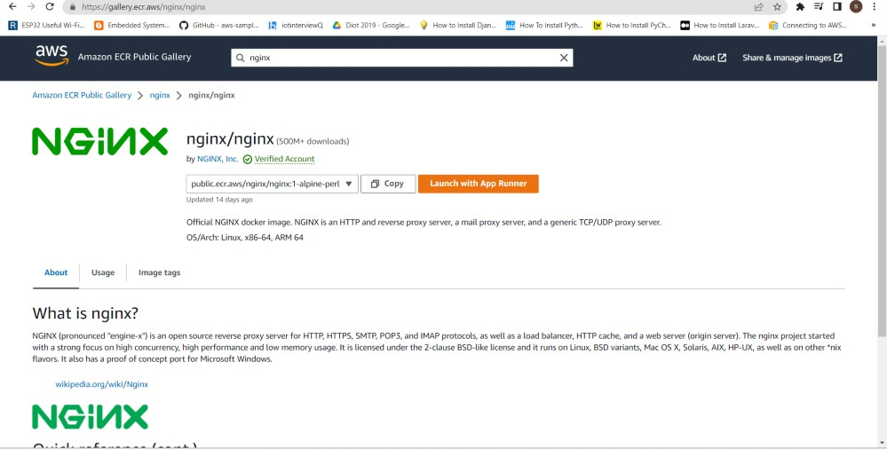

## Set up ECS (Elastic Container Service) by setting up Nginx on ECS.
#### Create an ECS cluster:

In the ECS service, click on `Create Cluster`.

Configure the cluster settings, such as the cluster name, VPC, subnet.

Click on `Create`

Cluster is successfully created.

#### Create a task definition:
In the ECS service, click on `Task Definitions`, and then click on `Create new Task Definition`.

Give the task definition a name

Browse `Amazon ECR public gallery` and search for `nginx image`  choose `alpine` and copy that image url.

Back to task definition, Set the container name to "nginx", paste Image url from 'Amazon ECR public gallery' site. Specify the port mappings for HTTP , by setting the "Container port" to 80.
* Protocol: TCP
* Port name: nginx:80tcp
* App protocol: HTTP

Click on `Next`

Choose the `AWS Fargate(serverless)` on `App Environment`, Choose your Operating system 

Configure the task settings, such as the task memory and CPU limits, here CPU is .5vCPU and memory is 1GB.

Click on `Next` and then Click on `Create`

Task is successfully created.

#### Create a service:
In the ECS, click on `Clusters`, and select the cluster that you created.

Click on `Create Service`.

Choose the task definition that you created in above steps.

Configure the service settings, such as the VPC, subnet, and security group settings. Create a new security group.

Specify the port mappings for HTTP with port 80.

Click on 'Create'.

Service is successfully created.

Once the ECS service is running, test the Nginx container by accessing the public IP address of the Fargate task in a web browser. You can find the public IP address in the `Tasks` tab of the ECS service, under the `Configuration` section.

#### Test the Nginx container:
Click on `Cluster` that you created.

Click on `Task`.

In task, go to `configuration` section, there you can find public ip.

Browse Public IP address, you can see the default Nginx welcome page.

