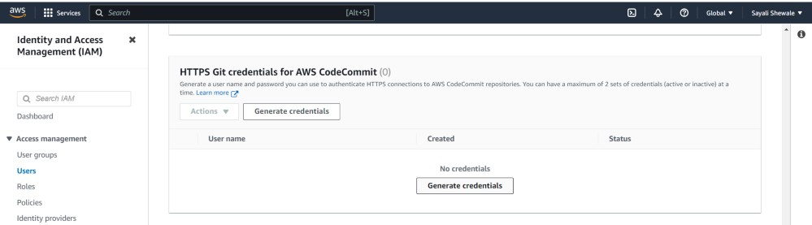
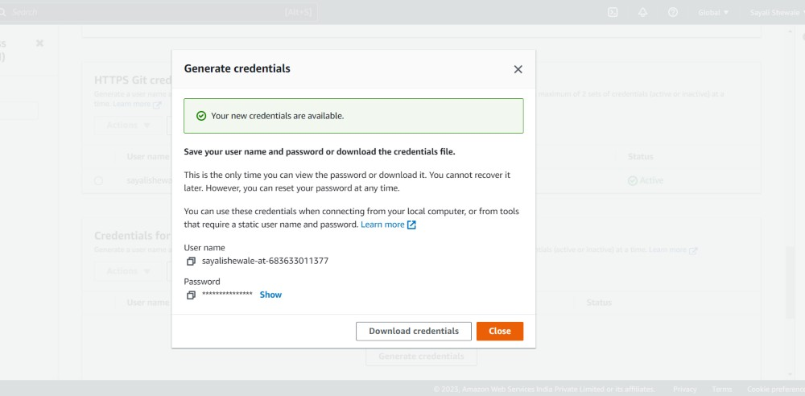

## CodeCommit

#### Set up a code repository on CodeCommit and clone it on your local.
Log in to the AWS Management Console and navigate to CodeCommit.

Click on `Create repository`.

Enter a name for your repository and click on `Create`

Repository is successfully created

#### You need to setup Git Credentials in your AWS IAM.
Go to IAM console

Click on `Users` in the left-hand menu, and then click on your username.

Scroll down to the `Security credentials` section.

In `HTTPS Git credentials for AWS CodeCommit` section, click on `Generate credentials`

Click on the `Download credentials` button to download your Git credentials and click on `close`.

Git credentials is created.

#### Use those credentials in your local and then clone the repository from CodeCommit

In Code Commit, Go inside your repository that you created in above steps, in right-hand side click on `Clone URL` and choose `Clone HTTPS`.

Open a terminal on your local machine.

Navigate to the directory where you want to clone the repository.

Run the following command:

    git clone <your-codecommit-repo-clone-https-url>

You will be prompted to enter your Git credentials. Enter the username and password that you downloaded earlier.

You have now set up a CodeCommit repository and cloned it on your local machine using Git Credentials in AWS IAM.

#### Add a new file from local and commit to your local branch
Create a new file in the local repository directory.

Check status using command 

    git status

Add the new file to your local branch using the following command:

    git add <filename>

Commit the changes to your local branch using the following command:

    git commit -m "added new file"

#### Push the local changes to CodeCommit repository.
Push the changes from your local branch to the CodeCommit repository using the following command:

    git push origin master

Verify that the changes have been pushed to the CodeCommit repository:

Go to the code commit repository that you created earlier, you should see the new file listed in the repository's files.

You can see content of the file.

