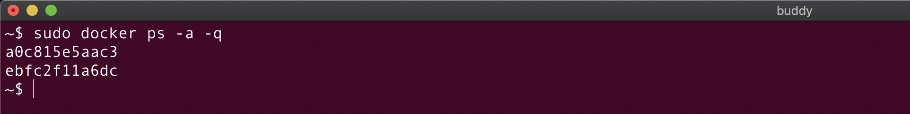
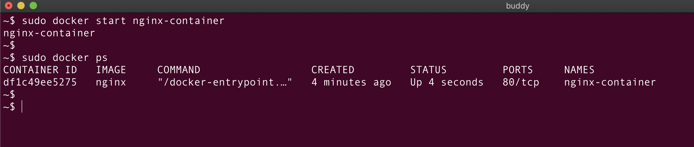
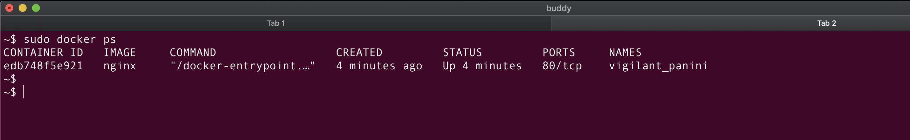
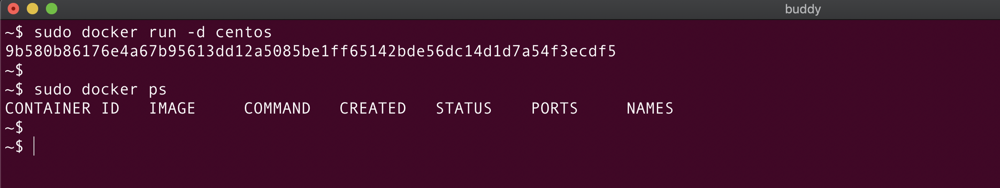
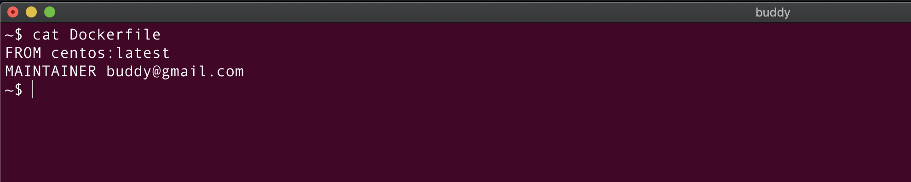
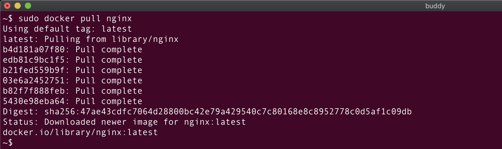

## Docker Commands Cheat Sheet
### TABLE OF CONTENTS

* Docker Container Commands
* List all the Running Containers
* List all the Containers (irrespective of the state)
* List all the Running Containers with the File Size
* List the IDs of the Running Containers
* List the IDs of all the Containers (irrespective of the state)
* Filter container list
* Creating a new Container using Docker Image
* Creating a new Container using Docker Image with some fixed name
* Start a Docker Container
* Stop a running Docker Container
* Restart a Docker container
* Pause a running Container
* Unpause a paused Container
* Docker Run command
* Docker Run command in Foreground and Detached Modes
* Delete the container on the exited state
* Run the container in daemon mode
* Run Docker Container with a name using the run command
* Listing Processes running in a Docker Container
* Map ports of a Docker Container
* Rename a Docker Container
* Run the Docker Container in an Interactive Mode
* Get Inside the Running Container (Literally!)
* Start a Docker Container and keep it running
* Copy a File from a Container to a Host
* Copy a File from the Host to the Docker Container
* Remove a specific Docker Container
* Remove a Docker Container after it exits
* Delete all the Stopped Containers
* Delete all the Docker Containers
* Create a Docker image from a Docker Container
* Run command inside the Docker Container
* Set Environment Variable in a Docker Container
* Set Environment Variable in a Docker Container using a File
* Docker Image Commands
* List all the Docker Images
* List the Docker Image Ids
* List all the Docker Images (including dangling images)
* Build a Docker Image
* Build Docker Images with a different tag
* Build a Docker Image using a custom named Dockerfile
* Build a Docker Image from a Dockerfile that is not in the Current Directory
* Show History of a Docker Image
* Rename an existing Docker Image
* Remove Docker images
* Force delete a Docker Image
* Unused Docker Images
* Dangling Docker Images
* List Dangling Docker Images
* Remove all the Dangling Docker Images
* Remove all the Dangling and Unused Docker Images
* Login to Docker
* Push a Docker Image to the Docker Registry
* Download a Docker Image from the registry
Docker logs
* Get Logs of the Docker container
* Monitor the Docker Container Logs
* Get the last 2 lines of the Container Logs
* Docker Network Commands
* List all the Networks
* Create a Network
* Connect a Docker Container to a Network:
* Connect a Docker Container to a Network on Start
* Disconnect a Docker container from a Network:
Remove a Network
* Show Information about one or more Networks
* Get the IP Address of the running Docker Container
* Docker Volumes
* Create Docker Volume
* List Docker Volumes
* Mounting Docker Volume using the -v Flag
* Mounting Docker Volume using the --mount Flag
* Get Details about a Docker Volume
* Remove a Docker Volume
* Volume Mount using bind-mount
* Creating Bind Mount Volume using the --mount flag
* Docker System-wide Commands
* Docker Info
* Docker Stats of the running Container
* Docker Stats of all the Containers
Show the Docker Version
* Get Detailed Info about an Object (Container, Image, Volume, etc)
* Get the Summary of Docker Usage
* Clean your Docker system

**Docker** is a containerization technology to build, ship and run applications inside containers. We can create different Docker containers for packaging different software as it uses virtualization at the level of an operating system.

This article is a comprehensive list of Docker commands that you can refer to while building applications and packaging them in Docker containers.

Let's first look at some of the fundamental container commands!

### Docker Container Commands

#### List all the Running Containers

    docker ps

We can also use docker container ps or docker container ls to list all the running containers.

There is no difference between docker ps and docker container ps commands with respect to the result of their execution.

docker ps is an old syntax and is supported for backward compatibility.

The docker container ls command is an appropriate version of the command compared to ps as ls is a shortcut for list.

#### List all the Containers (irrespective of the state)

    docker ps -a

Please note: -a is the short form for --all and they both can be used interchangeably.

    docker ps -all

This command is used for listing all the containers (active and inactive).

As can be seen from the screenshot above, the container objective_margulis is not running while the container sharp_cori is up since the last hour.

#### List all the Running Containers with the File Size

    docker ps -s
    
    docker container ls -s
    
-s is the short form --size

This command adds SIZE column to the output.

As it can be seen from the screenshot above, 1.09kB is the disk space used by the container (writable layer). In simple words, the value in the SIZE column represents the size of the data that is written by the container in its writable layer.

This text virtual 133MB represents the amount of disk space used by the image of this container.

#### List the IDs of the Running Containers

    docker ps -q
    
    docker container ls -q

-q is the short form for --quiet. This command modifies the docker ps output and displays only the Ids of the running containers.

#### List the IDs of all the Containers (irrespective of the state)

    docker ps -a -q

We can also write the above command by combining a and q as:

    docker ps -aq

#### Filter container list
We can filter the output of docker ps or docker ps -a commands using the --filter option as:

    docker ps -f name=un
    
-f is the short form for --filter

In the above screenshot, the command filters the containers and only displays the ones whose name starts with un

Similarly, we can add -f option with the docker ps -a command:

    docker ps -a -f name=ar

We can also filter the containers on the basis of the status as:

    docker ps -a -f status=running

As seen in the above screenshot, the filter command filters the containers and displays only the running ones in the list!

#### Creating a new Container using Docker Image

    docker create <image_name>

The docker create command is used to create a new container using a Docker image. It does not run the container but just adds a writable layer on top of the Docker image. We'll have to run the docker start command to run the created container.

As docker create command interacts with the container object, we can also use the below command:

    docker container create <image_name>
    
Let's create a container using an nginx Docker image:

    docker create nginx

Perfect! The container is created. Let's verify that using the docker ps command:

The status of the container is Created as expected!

Please note the name of the nginx container trusting_bouman is some random string and would be different on your system.

We can also create a Docker container with some fixed names. Let's do that right away!

#### Creating a new Container using Docker Image with some fixed name

    docker create --name <container_name> <image_name>
    
    docker container create --name <container_name> <image_name>
    
Let's create a container named nginx-container using nginx image:

    docker create --name nginx-container nginx

Neat! The container nginx-container is created!

#### Start a Docker Container
We can run an already created command using the below command:

    docker start <container_id or container_name>

OR

    docker container start <container_id or container_name>
    
We can use the docker start command either using the container ID or name.

Let's start the nginx-container:

    docker start nginx-contianer

We can also start it as:

    docker start df1c49ee5275

As seen from the above screenshot, nginx-container is created and the docker ps command is used to verify the status of the container.

#### Stop a running Docker Container

    docker stop <container_id or container_name>

OR

    docker container <container_id or container_name>
    
Here's the command for stopping the nginx-container:

    docker stop nginx-container

As seen in the above screenshot, the container nginx-container is exited 17 seconds ago. This container won't be listed in the docker ps command.

#### Restart a Docker container

    docker restart <container_id or container_name>

OR

    docker container restart <container_id or container_name>

The nginx-container is now restarted and is up for the last 8 seconds.

#### Pause a running Container

    docker pause <container_id or container_name>

OR

    docker container pause <container_id or container_name>

Let's try to pause the nginx-container:

    docker pause nginx-container

#### Unpause a paused Container
To again run the paused container, we can use the below command:

    docker unpause <container_id or container_name>

    docker container unpause <container_id or container_name>

To unpause the nginx-container, we can use the below command

    docker unpause nginx-container

#### Docker Run command
As implied from the name, this command is used to run the container!

It is a combination of the create and the start commands. This command creates the container and starts it in one go!

The docker create or docker container create command creates the container and to run the container, we have to use the docker start command.

It rarely happens that we will create the container and run it later. Generally, in real-world cases, we would create and run the container in one go using the docker run command.

Here's how we can run a Docker container:

    docker run <image_name>

    docker container run <image_name>

If the Docker image is locally available, Docker will run the container using that image otherwise it would download the image from the remote repository.

#### Docker Run command in Foreground and Detached Modes
The Docker container can run in two modes:

1. Foreground mode
2. Background or detached mode

Docker runs the container in the foreground mode by default. In this mode, Docker starts the root process in the container in the foreground and attaches the standard input(stdin), output(stdout), and error(stderr) of the process to the terminal session.

In the foreground mode, you cannot execute any other command on the terminal session until the container is running. This is the same as running a Linux process in the foreground mode.

Let's create and run a container in the foreground mode using the nginx Docker image:

    docker container run nginx

The above screenshot shows the output of the Nginx container on the terminal. The Nginx process is running in the foreground and hence this terminal session cannot be used for executing other commands or performing any other operation.

If you end the terminal session by closing the terminal tab or by using the exit command, the container will die automatically and the Nginx process would stop running.

Please open a new terminal tab to verify if the container is running:

    docker ps

The run command worked as expected - it created the container and also started the container.

The long-running processes such as Nginx are run in the background mode and so are not dependent on the terminal session.

If we end the terminal session by closing the terminal tab or by pressing CTRL + C, the container will die automatically.

Let's stop the nginx process using CTRL+C!

Now if you execute the docker ps command, you can see that the container is in exited stated but it is not deleted. This is because when the container exits or when we stop the container, the filesystem of the container continues to persist on the host machine.

#### Delete the container on the exited state
If you want to also delete the container after it is exited, you can start the container in the foreground using this command:

    docker run --rm nginx
    
This command would start the nginx container in the foreground mode. If you kill the terminal session, it would stop the container and delete it!

--rm option removes the filesystem of the container once it is stopped or when the container exits automatically.

#### Run the container in daemon mode
To run the container in the background or in daemon mode, we can use the -d(--detach) option.

    docker run -d <image_name>
    
-d option will run the container in the background mode and print the container ID

Let's run a container with nginx image in the background mode:

From the above image, we can see that the container process is not attached to the terminal session and the container is running in the background mode.

Let's verify if the container is in the running state using the docker ps command:

#### Run Docker Container with a name using the run command
We can use --name option to assign a name to the container as shown below:

    docker container run -d --name <container_name> <image_name>

Let's create a container named nginx-container from nginx image:

    docker container run -d --name nginx-container nginx

#### Listing Processes running in a Docker Container

    docker top <container_name or container_id>

OR

    docker container top <container_name or container_id>

Here, we can see that inside nginx-container there are two processes running with the Ids 4685 and 4747.

#### Map ports of a Docker Container
Docker exposes the same port on the host machine that is exposed by the container.

We know that nginx process listens on port 80. Hence, a container running an nginx process will expose port 80 on the container.

Docker will map port 80 of the nginx container with port 80 of the host machine. The nginx container will be accessible to the outside world from port 80 of the host machine.

We know that one port cannot be used by multiple processes.

But what if we want to run multiple nginx containers on the same host machine?

We can use port mappings provided by Docker to achieve this!

The port mappings allow us to map a port on the container with a different port on the host machine.

We can map the ports of the container while creating the container as shown below:

    docker container run --name <container_name? -d -p <host_post>:<container_port> <image_name>
    
To expose nginx container (port 80) on port 8080 of the host machine, we can use the below command:

    docker container run --name nginx-container -d -p 8080:80 nginx

The port mappings are also indicated in the docker ps command as shown in the above screenshot!

As the container is mapped to the port 8080 of the host machine, we can access the Nginx container on 8080 using the curl command. Let's try that out!

This works as expected!

#### Rename a Docker Container

    docker rename <old_name> <new_name>

OR

    docker container rename <old_name> <new_name>
    
Let's rename nginx-container to nginx-cont:

    docker rename nginx-container nginx-cont

#### Run the Docker Container in an Interactive Mode

When we run the container in an interactive mode, Docker will attach the stdin(standard input) of the container to the terminal.

This will give us entry inside the container and now we can run any command inside the container.

Let's understand this with an example:

    docker container run -it <image_name> /bin/bash

This command simply means that we want to start the bash shell inside the container.

Let's create a container from an Nginx image and run the bash command inside the container:

    docker container run -it nginx /bin/bash

Super! We're inside the container!

We can now execute any command inside the container.

Please open another tab and let's list down the processes running inside the container:

    docker top wonderful_visvesvaraya

As seen in the above screenshot, only one process is running inside the nginx container. This is the same process that we have opened in Tab 1.

When we had checked the processes running inside the nginx-container earlier, we saw two processes (nginx master and worker) inside the nginx container but now there is just one process - bash shell.

This is because we passed /bin/bash command to the docker run command. This command overrides the dockerfile CMD or Entrypoint commands and so the Nginx processes were not started inside the Nginx container.

#### Get Inside the Running Container (Literally!)

If you have a container that is already running and you want to go inside that container, here's a command that will take you to the container world:

    docker exec -it <contaner_id or container_name> /bin/bash

Let's start the nginx container in the daemon mode:

    docker run -d --name nginx-container nginx

We can go inside this container as:

    docker exec -it nginx-container  /bin/bash

The docker exec command executes the /bin/bash command and starts a bash shell session inside the container as shown in the below screenshot:

Sweet! This is quite a handy command and is used more often to get into the running container and perform some operations.

Note: Apart from /bin/bash, we can pass any command that we want to execute inside the container. Here's a quick example:

    docker exec -it nginx-container echo "Hello, from container"

#### Start a Docker Container and keep it running
The life of a container depends on the root process inside the container. So far we have run nginx process inside the containers.

nginx is a long and continuous running process and hence the Nginx container continues to run and does not die!

If we run a process that is short-lived inside the container, it will die once that process dies!

For example, if we run a container using the centos Docker image, it will die as soon as the process inside the centos dies.

centos has a default command bash. The bash command runs and dies immediately.

Hence, the centos container also dies immediately as shown below:

To continue running the container that has a short-lived process, we can use the below command:

    docker run -dt <image_name>
    
-d will run the ubuntu container in the background and -t option allocates a "pseudo-tty"

To continuously run the container created from centos image, we can use the below command:

    docker run -dt centos

#### Copy a File from a Container to a Host
The Docker container and the host file systems are isolated from each other. We cannot use the normal cp or copy command to copy content from the container to the host and vice-versa.

To copy content from the container to the host machine, we can use the below command:

    docker cp <container_id or container_name>:<source_file_path> <destination_path>

Let's understand this with the help of an example:

As seen in the above screenshot, we have created a file file_insider_container.txt inside the centos-container.

Let's copy this file from the container to the host machine:

    docker cp centos-container:file_insider_container.txt .
The . in the above command signifies that the destination path is the current location on the host machine.

We can see that file_inside_container.txt has been copied on the current directory of the host machine.

#### Copy a File from the Host to the Docker Container
We can copy a file from the host system to the Docker container as:

    docker cp <location_of_file_on_host> <container_id or container_name>:<file_desinaion>

Let's create a file file_on_host.txt on the machine and copy it inside the container.

As seen in the above screenshot, we have created a file file_on_host.txt on the host machine.

Let's copy this file inside the centos-container using the below command:

    docker cp file_on_host.txt centos-container:/

The file file_on_host.txt has been copied inside the centos-container container.

#### Remove a specific Docker Container
To remove a Docker container, you first have to stop the running container and then delete it:

    docker stop <container_name or container_id>

OR

    docker container stop <container_name or container_id>

Once the container stops, you can remove it using the below command:

    docker rm <container_name or container_id>

If you want to directly remove the container without stopping it, you can use the below command:

    docker rm -f <container_name or container_id>

-f is for forcefully removing the running container.

#### Remove a Docker Container after it exits

    docker run --rm <image_name>

This will create and run a container that will be deleted automatically once the container stops.

#### Delete all the Stopped Containers
To delete all the stopped containers, we can use the below command:

    docker container prune

#### Delete all the Docker Containers
This command is used to delete all the running as well as the stopped containers:

    docker rm -f $(docker ps -a -q)
    
    docker container rm -f $(docker ps -a -q)

We know that docker ps -a -q will list all (running as well as not running) container Ids. Once we get the Ids using the rm option, we can then remove all the containers.

#### Create a Docker image from a Docker Container

    docker container commit <container_id or container_name> <new_image_name>

OR

    docker commit <container_id or container_name> <new_image_name>

Consider the example below:

We'll create a file file_inside_container.txt inside the running container centos-container:

Let's now create an image (centos-with-new-file) from centos-container using the below command:

    docker container commit centos-container centos-with-new-file

As shown in the above image, we created a new image centos-with-new-file and using this image, we created a new container centos-with-new-file-container.

As centos-with-new-file image was created from centos-container that had a file file_inside_container.txt, the containers created from centos-with-new-file image would also have file_inside_container.txt.

#### Run command inside the Docker Container
We have already seen that we can directly go inside the container using the docker exec command.

Let's see how we can execute commands inside the container without actually going inside the container.

To run any command inside the container, we can use the docker exec command as shown below:

    docker exec -it <container_id or container_name> <command>
    
For example, to get the list of processes running inside the centos image, we can use the below command:

    docker exec -it f40cc2e51d5b ps -afe

#### Set Environment Variable in a Docker Container
We can set environment variables inside the container environment using the below command:

    docker run --env ENV_VAR1=value1 --env ENV_VAR1=value2 --name <container_name> <image_name>

To create an environment variable with the name NAME and value Buddy inside the centos image, we can use the below command:

    docker run -dt --env NAME=Buddy --name centos-container centos

-dt is added to run the centos-container in daemon mode and to prevent it from dying immediately.

To check if the environment variable has been set inside the container, we can use the below commands:

    docker exec -it centos-container printenv

The docker exec command executes printenv (to print environment variable) inside the centos-container container and prints the output on the terminal.

#### Set Environment Variable in a Docker Container using a File
We can also set environment variables inside the container using a file.

The file file1.txt consists of key-value pairs as shown below:

To create environment variables from a file we can use the below command:

    docker run --env-file <path_to_the_file> --name <container_name> <image_name>

The --env-file flag takes a filename as an argument. Each line in the file should be in the format VAR=VAL.

Let's create environment variables inside the centos-container-1 container using the file file1.txt:

    docker run -dt --env-file file1.txt --name centos-container-1 centos

-dt is added to run the centos-container in daemon mode and to prevent it from dying.

#### Docker Image Commands
In this section, we will look at the Docker image commands.

**List all the Docker Images**
Here's a command to list all the images that are locally stored:

    docker images

**List the Docker Image Ids**

    docker images -q

**List all the Docker Images (including dangling images)**

    docker images -a

-a stands for all

**Build a Docker Image**
We can build a Docker image from a Dockerfile using the below command:

    docker build -t <image_name> <contenxt_dir>

Docker will try to find a file named Dockerfile inside the context_dir and it would then create a Docker image using the Dockerfile file.

Let's create a Dockerfile as shown below in the current directory:

We can now build a Docker image centos from this Dockerfile using the below command:

    docker build . -t centos_buddy

Here, dot (.) indicates that the context directory is the current directory.

Let's verify if the image has been created:

**Build Docker Images with a different tag**

    docker build . -t <image_name>:<tag or version>

The above command will build an image with imagename and tag 1.8.

Here's an example:

    docker build . -t centos_buddy:1.8

**Build a Docker Image using a custom named Dockerfile**
We can build a Docker image from a Dockerfile which is not named Dockerfile using the below command:

    docker build -f <custom_docker_file_name> -t <image_name> .
Let's create a Dockerfile with name custom_docker_file:

    docker build -f custom_docker_file -t centos_custom .

**Build a Docker Image from a Dockerfile that is not in the Current Directory**

    docker build -f </path/to/dockerfilename>  -t <image_name> .

**Show History of a Docker Image**

    docker history <imagename or imageid>

The above screenshot shows the history for the image centos_buddy.

**Rename an existing Docker Image**

    docker tag <imagename> <newname>:<version>

**Remove Docker images**

    docker rmi <image_name or image_id>

This command will delete the Docker image if the image is not used by any container.

#### Force delete a Docker Image

    docker rmi -f <image_name or image_id>

**Unused Docker Images**
Unused Docker images are not used by any containers.

The images that are displayed when we do docker ps -a are used by some of the existing containers.

So, the unused images are:

(All images from docker images -a) - (all images from docker ps -a)

**Dangling Docker Images**
When we build a Docker image using Dockerfile, Docker creates an image with the given name.

Here's a simple example:

    docker build . -t imagename

Docker will create an image from the Dockerfile in the current directory with the name imagename.

If we do some changes in the Dockerfile and rebuild the image again with the same name, Docker will update the name of the previous image to <none> and tag it <none>.

These images with the name <none> and tag <none> are called dangling images.

**List Dangling Docker Images**

    docker images -f dangling=true

**Remove all the Dangling Docker Images**

    docker image prune

If the dangling images are referenced by containers (either running or not running), Docker will not prune these dangling images.

To remove dangling images, we've to make sure that they are not referenced by any container.

We can first run docker container prune to remove all the stopped containers and the docker images command will now remove the dangling images that were referenced by these stopped containers.

We can also use the below command to remove the dangling images:

    docker rmi $(docker images -f dangling=true -q)

docker images -f dangling=true -q would return the Ids of all the dangling images.

**Remove all the Dangling and Unused Docker Images**

    docker image prune -a

**Login to Docker**
To login to Docker hub, we can use the below command:

    docker login

You can enter your username and password to log in to Docker hub.

**Push a Docker Image to the Docker Registry**
Once we are logged in to Docker hub, we can push the Docker images to the registry using the below command:

    docker push repository_name/imagename:tag

**Download a Docker Image from the registry**

    docker pull imagename:tag

If the image is not present on the host machine, Docker will pull the image from the Docker registry.

If no tag is specified, Docker will pull the latest image.

### Docker logs
Let's now look at some commands useful for checking logs in a Docker container:

**Get Logs of the Docker container**
We can get the logs of the Docker container as:

    docker container logs <container_id or container_name>

The above screenshot shows the logs of the container nginx-container.

**Monitor the Docker Container Logs**
To display the last few lines of the container logs and monitor them, we can use the below command:

    docker container logs -f <container_id or container_name>
    
The new messages in the container would be displayed here! This is similar to the tail -f command.

**Get the last 2 lines of the Container Logs**

    docker container logs --tail 2 <container_id or container_name>

### Docker Network Commands
Here are some of the useful Docker Network commands:

**List all the Networks**

    docker network ls

**Create a Network**

    docker network create --driver <driver-name> <bridge-name>
    
driver-name can be either bridge or overlay

bridge would be used by default if --driver option is not provided.

    docker network create --driver bridge new-network

The network called new-network is created successfully!

**Connect a Docker Container to a Network:**

    docker network connect <network_id or network_name> <container_id or container_name>

The above command will connect the container with the specified network. Let's look at an example:

The container nginx-container is connected to the network new-network and we can verify this using docker network inspect:

**Connect a Docker Container to a Network on Start**
This command connects a Docker container to a network as soon as it starts:

    docker run -d --network=<network_name or id> <contaienr_name>

**Disconnect a Docker container from a Network:**

    docker network disconnect <network_name_or_id> <container_name_or_id>

**Remove a Network**

    docker network rm <network_id or network_name>

**Show Information about one or more Networks**

    docker network inspect <network_id or network_name>

**Get the IP Address of the running Docker Container**

    sudo docker inspect -f '{{range.NetworkSettings.Networks}}{{.IPAddress}}{{end}}' <container_name or container_id>

### Docker Volumes
In this section, we'll look at some of the commonly used Docker volumes commands!

**Create Docker Volume**

    docker volume create --name volume-name

**List Docker Volumes**

    docker volume ls

**Mounting Docker Volume using the -v Flag**
We can mount the volume inside the Docker container once it is created using the below command:

    docker run -it --name <container-name> -v <volume-name>:<path-in-container-where-volume-is-mounted> <image-name>

We are creating a new container with the container name <container-name> using the image <image-name> and then mount the volume volume-name inside the container at path-in-container-where-volume-is-mounted.

**Mounting Docker Volume using the --mount Flag**

    docker run -it --name <container-name> --mount soure=<volume-name>, destination=<path-in-container-where-volume-is-mounted> <image-name>

**Get Details about a Docker Volume**

    docker volume inspect <volume-name>

**Remove a Docker Volume**
To remove the volume, we first have to remove the containers using that volume and then only we can remove the volume.

To remove the volume we can use the below command:

    docker volume rm <volume-name>

**Volume Mount using bind-mount**
To mount any specific host directory inside the container, we have to use the below Docker run command:

    docker run -it -v /path/on/host:/path/in/contianer/where/volume/has/to/be/mounted <image-name>
    
**Creating Bind Mount Volume using the --mount flag**

    docker run -it --name <container_name> --mount type=bind,source=/path/on/host/,target=/path/on/container first-image

If a directory in a container has some content and you mount the volume with type bind onto that directory, the existing content of that directory would be lost and you get an empty directory.

### Docker System-wide Commands

**Docker Info**

    docker info

**Docker Stats of the running Container**

    docker stats

**Docker Stats of all the Containers**

    docker stats --all

**Show the Docker Version**

    docker version

**Get Detailed Info about an Object (Container, Image, Volume, etc)**

    docker inspect <name or id>
    
    docker inspect nginx

**Get the Summary of Docker Usage**

    docker system df

This gives the information about:

The total size of all the containers
The total size of all the images
The total size of the volumes
Cache

**Clean your Docker system**

    docker system prune

This command will clean:

All the stopped containers
All the networks not used by at least one container
All the dangling images
All the dangling build cache
