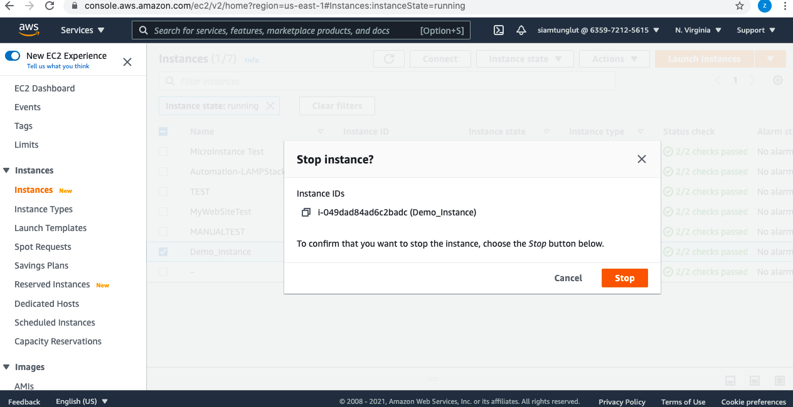
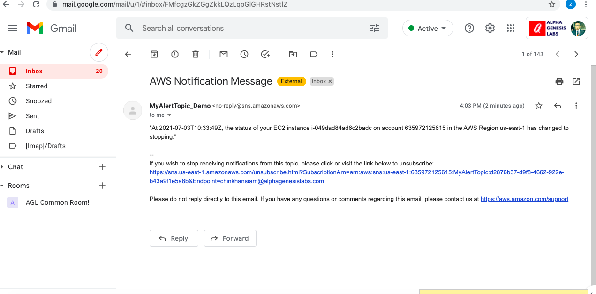

## Trigger Email Notification On EC2 Instance State Changes Using SNS and Cloudwatch
* ### Create an SNS topic

1. Open the Amazon SNS console

2. Select `Topics` from the navigation pane.

3. Click on `Create topic`.

4. For `Type`, Select the Standard.
5. For `Name`, enter a name for your topic.
6. For `Display name`, enter a display name for your topic.
7. On the Subscriptions tab, click Create subscription.

8. You select the ARN of the topic that you have just created in Type ARN
9. For Protocol, Select Email.

10. For Endpoint, enter the email address where you want to receive the notifications.

11. Click on the `Create subscription` tab and it is created.
12. A subscription confirmation email is sent to the address you entered.Click on the confirm link to confirm the subscription.
13. Below is the subscription confirmation page.

### Creating a CloudWatch event:
1. Open the CloudWatch Console, and then go to Events > Rules > Create rule

2. Click on `Create Rule`.
3. For Event Source, Click on `Event Pattern`.
4. For Service Name, Select `EC2`.
5. For Event Type, Select  `EC2 Instance State-change Notification`.
6. Tick on  `Any state`.
7. Tick on `Any instance`.

8. In the Targets section.
For Targets, select `SNS topic`.
9. For Topic, select the topic name that you created earlier.

10. For Configure input, select `Input Transformer`.
11. For Input Path, enter the following:

        {“instance-id”:”$.detail.instance-id”, “state”:”$.detail.state”, “time”:”$.time”, “region”:”$.region”, “account”:”$.account”}

12. For Input Template, enter the following:

        “At <time>, the status of your EC2 instance <instance-id> on account <account> in the AWS Region <region> has changed to <state>.”

**Note**: The Input Template also allows custom inputs.

13. Click `Configure details`.
14. For Name, enter a rule name.
15. For Description, enter a rule description.

16. Then click on `Create rule` to complete rule creation.
17. We can verify by changing the states of the instance in the EC2 console. Open the EC2 Console

18. Select any instance and change the instance state manually. In this case we are Stopping an Instance.

19. When the state of the instance is changed into “Stopping” from “running”. An Email alert is sent to our email address given in the SNS topic.

20. And When the instance state changes to “Stopped” from “Stopping”. 

21. Then again we get an Email alert confirming the same. 

