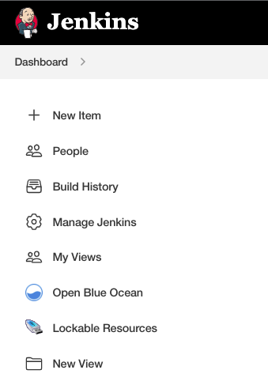
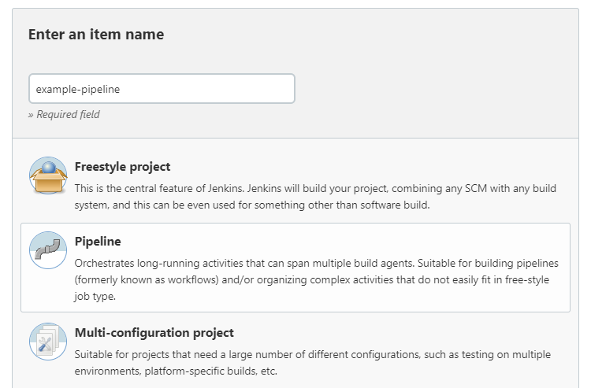
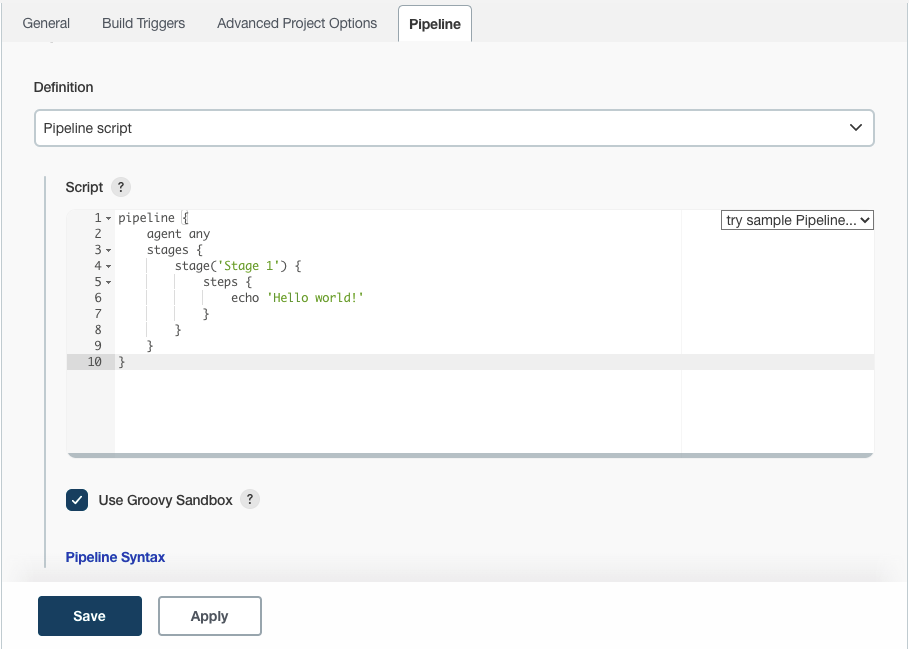
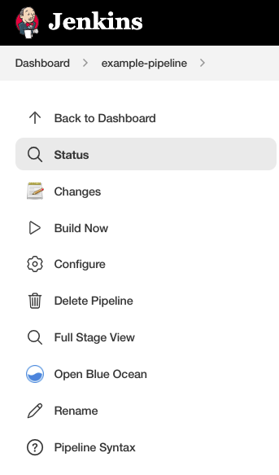
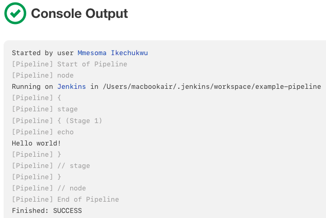

## Getting Started with Jenkins Pipeline
As mentioned previously, Jenkins Pipeline is a suite of plugins that supports implementing and integrating continuous delivery pipelines into Jenkins. Pipeline provides an extensible set of tools for modeling simple-to-complex delivery pipelines "as code" via the Pipeline DSL.

## Defining a Pipeline

Both Declarative and Scripted Pipeline are DSLs to describe portions of your software delivery pipeline. Scripted Pipeline is written in a limited form of Groovy syntax.

Relevant components of Groovy syntax will be introduced as required throughout this documentation, so while an understanding of Groovy is helpful, it is not required to work with Pipeline.

A Pipeline can be created in one of the following ways:

1. Through Blue Ocean - after setting up a Pipeline project in Blue Ocean, the Blue Ocean UI helps you write your Pipeline’s Jenkinsfile and commit it to source control.

2. Through the classic UI - you can enter a basic Pipeline directly in Jenkins through the classic UI.

3. In SCM - you can write a Jenkinsfile manually, which you can commit to your project’s source control repository.

The syntax for defining a Pipeline with either approach is the same, but while Jenkins supports entering Pipeline directly into the classic UI, it is generally considered best practice to define the Pipeline in a Jenkinsfile which Jenkins will then load directly from source control.

## Through Blue Ocean

If you are new to Jenkins Pipeline, the Blue Ocean UI helps you set up your Pipeline project, and automatically creates and writes your Pipeline (i.e. the Jenkinsfile) for you through the graphical Pipeline editor.

As part of setting up your Pipeline project in Blue Ocean, Jenkins configures a secure and appropriately authenticated connection to your project’s source control repository. Therefore, any changes you make to the Jenkinsfile via Blue Ocean’s Pipeline editor are automatically saved and committed to source control.

Read more about Blue Ocean in the Blue Ocean chapter and Getting started with Blue Ocean page.

## Through the classic UI

A Jenkinsfile created using the classic UI is stored by Jenkins itself (within the Jenkins home directory).

To create a basic Pipeline through the Jenkins classic UI:
1. If required, ensure you are logged in to Jenkins.
2. From the Jenkins home page (i.e. the Dashboard of the Jenkins classic UI), click **New Item** at the top left.
 

3. In the **Enter an item name** field, specify the name for your new Pipeline project.
**Caution**: Jenkins uses this item name to create directories on disk. It is recommended to avoid using spaces in item names, since doing so may uncover bugs in scripts that do not properly handle spaces in directory paths.

4. Scroll down and click **Pipeline**, then click **OK** at the end of the page to open the Pipeline configuration page (whose **General** tab is selected).

5. Click the **Pipeline** tab at the top of the page to scroll down to the **Pipeline** section.
**Note**: If instead you are defining your `Jenkinsfile` in source control, follow the instructions in `In SCM` below.

6. In the **Pipeline** section, ensure that the **Definition** field indicates the **Pipeline script** option.

7. Enter your Pipeline code into the **Script** text area.
For instance, copy the following Declarative example Pipeline code (below the *Jenkinsfile ( …​ )* heading) or its Scripted version equivalent and paste this into the **Script** text area. (The Declarative example below is used throughout the remainder of this procedure.)
`Jenkinsfile (Declarative Pipeline.`

        pipeline {
                agent any (1)
                stages {
                    stage('Stage 1') {
                        steps {
                            echo 'Hello world!' (2)
                        }
                    }
                }
            }

`Toggle Scripted Pipeline (Advanced)`

1. agent instructs Jenkins to allocate an executor (on any available agent/node in the Jenkins environment) and workspace for the entire Pipeline.
2. echo writes simple string in the console output.
3. node effectively does the same as agent (above).

**Note**: You can also select from canned *Scripted* Pipeline examples from the **try sample Pipeline** option at the top right of the **Script** text area. Be aware that there are no canned Declarative Pipeline examples available from this field.

8. Click **Apply** and then **Save** to open the Pipeline project/item view page.

9. On this page, click **Build Now** on the left to run the Pipeline.

10. Under **Build History** on the left, click #1 to access the details for this particular Pipeline run.

11. Click **Console Output** to see the full output from the Pipeline run. The following output shows a successful run of your Pipeline.

