## Basic Linux Commands
**What Is Linux?**
Linux is an operating system's kernel. You might have heard of UNIX. Well, Linux is a UNIX clone. But it was actually created by Linus Torvalds from Scratch. Linux is free and open-source, that means that you can simply change anything in Linux and redistribute it in your own name! There are several Linux Distributions, commonly called “distros”.
* Ubuntu Linux
* Red Hat Enterprise Linux
* Linux Mint
* Debian. It can be anything, from an empty txt file to an empty zip file. For example, “touch new.txt”.
* Fedora

Linux is Mainly used in servers. About 90% of the internet is powered by Linux servers. This is because Linux is fast, secure, and free! The main problem of using Windows servers are their cost. This is solved by using Linux servers. The OS that runs in about 80% of the smartphones in the world, Android, is also made from the Linux kernel. Most of the viruses in the world run on Windows, but not on Linux!

**Linux Shell or “Terminal”**

So, basically, a shell is a program that receives commands from the user and gives it to the OS to process, and it shows the output. Linux's shell is its main part. Its distros come in GUI (graphical user interface), but basically, Linux has a CLI (command line interface). In this tutorial, we are going to cover the basic commands that we use in the shell of Linux.

To open the terminal, press Ctrl+Alt+T in Ubuntu, or press Alt+F2, type in gnome-terminal, and press enter. In Raspberry Pi, type in lxterminal. There is also a GUI way of taking it, but this is better!

## Linux Commands

**Basic Commands**

1. **pwd** — Is called **Print Working Directory**. When you first open the terminal, you are in the home directory of your user. To know which directory you are in, you can use the **“pwd”** command. It gives us the absolute path, which means the path that starts from the root. The root is the base of the Linux file system. It is denoted by a forward slash( / ). The user directory is usually something like "/home/username".

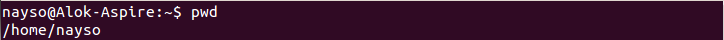
2. **ls** — Is called the **List** command. Use the "**ls**" command to know what files are in the directory you are in. You can see all the hidden files by using the command “**ls -a**”.
**ls -R** will list all the files in the sub-directories as well
**ls -a** will show the hidden files
**ls -al** will list the files and directories with detailed information like the permissions, size, owner, etc.

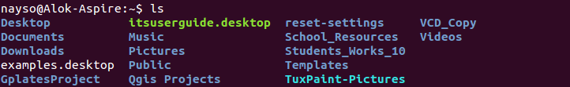

3. **cd** — Commonly called **Change Directory**. Use the "**cd**" command to go to a directory. For example, if you are in the home folder, and you want to go to the downloads folder, then you can type in **“cd Downloads**”. Remember, this command is case sensitive, and you have to type in the name of the folder exactly as it is. But there is a problem with these commands. Imagine you have a folder named “**Raspberry Pi**”. In this case, when you type in “**cd Raspberry Pi**”, the shell will take the second argument of the command as a different one, so you will get an error saying that the directory does not exist. Here, you can use a backward slash. That is, you can use “**cd Raspberry\ Pi**” in this case. Spaces are denoted like this: If you just type “**cd**” and press enter, it takes you to the home directory. To go back from a folder to the folder before that, you can type “**cd ..**” . The two dots represent back.
**cd -** (with a hyphen) to move to your previous directory. And typing it again, takes you back to the directory that you were

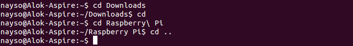

4. **mkdir & rmdir** — Use the **mkdir** command when you need to create a folder or a directory. Eg.

       mkdir jason

For example, if you want to make a directory called “**DIY**”, then you can type “**mkdir DIY**”. Remember, as told before, if you want to create a directory named “DIY Hacking”, then you can type “mkdir **DIY\ Hacking**”. Use **rmdir** to delete a directory. But **rmdir** can only be used to delete an empty directory. To delete a directory containing files, use **rm**.
You can also use **rm -rf** to remove a directory.
The "r" in **rm -rf** means "reculsively" and the "f" means "forcefully". Eg.

       rm -rf jason

To create a file, use **touch** command. Eg.

    touch jason

To delete a file, use rm. Eg.

    rm jason

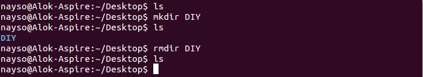

5. **rm** - Use the **rm** command to delete files and directories.  Use "**rm -r**" to delete just the directory. It deletes both the folder and the files it contains when using only the **rm** command.

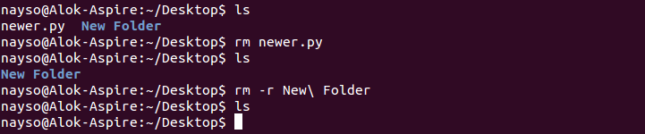

6. **touch** — The **touch** command is used to create a file. It can be anything, from an empty txt file to an empty zip file. For example, “**touch new.txt**”.

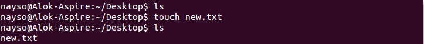

7. **man & --help** — To know more about a command and how to use it, use the **man** command. It shows the manual pages of the command. For example, “**man cd**” shows the manual pages of the **cd** command. Typing in the command name and the argument helps it show which ways the command can be used (e.g., **cd –help**).

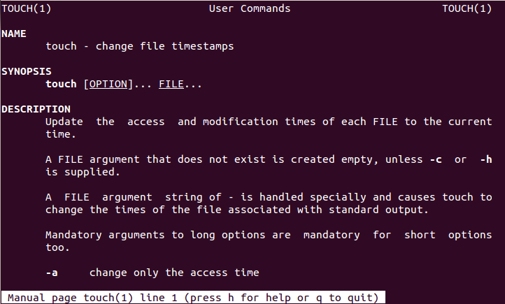

8. **cp** — Use the **cp** command to copy files through the command line. It takes two arguments: The first is the location of the file to be copied, the second is where to copy.
Use the **cp** command to copy files from the current directory to a different directory. For instance, the command 

       cp scenery.jpg /home/username/Pictures

would create a copy of **scenery.jpg** (from your current directory) into the Pictures directory.

To copy a folder/directory, use **cp -r**. Eg.

        cp -r jason

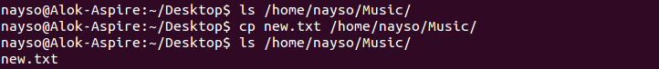

9. **mv** — Use the **mv** command to move files through the command line. We can also use the **mv** command to rename a file. For example, if we want to rename the file “**text**” to “**new**”, we can use 

       mv text new

It takes the two arguments, just like the **cp** command.

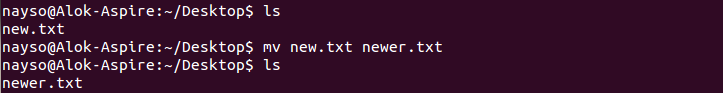

10. **locate** — The **locate** command is used to locate a file in a Linux system, just like the search command in Windows. This command is useful when you don't know where a file is saved or the actual name of the file. Using the -i argument with the command helps to ignore the case (it doesn't matter if it is uppercase or lowercase). So, if you want a file that has the word “hello”, it gives the list of all the files in your Linux system containing the word "hello" when you type in 

        locate -i hello

If you remember two words, you can separate them using an asterisk (*). For example, to locate a file containing the words "hello" and "this", you can use the command `locate -i hello*this`.

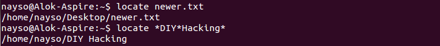

## Intermediate Commands

1. **echo** — The "**echo**" command helps us move some data, usually text into a file. For example, if you want to create a new text file or add to an already made text file, you just need to type in, “

       echo hello, my name is alok >> new.txt.

You do not need to separate the spaces by using the backward slash here, because we put in two triangular brackets when we finish what we need to write.

2. **cat** — Use the **cat** command to display the contents of a file. It is usually used to easily view programs.
Here are other ways to use the cat command:

* cat > filename creates a new file
* cat filename1 filename2>filename3 joins two files (1 and 2) and stores the output of them in a new file (3)
* to convert a file to upper or lower case use, cat filename | tr a-z A-Z >output.txt

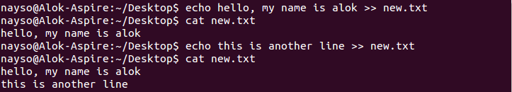

3. **nano, vi, jed** — **nano** and **vi** are already installed text editors in the Linux command line. The **nano** command is a good text editor that denotes keywords with color and can recognize most languages. And **vi** is simpler than nano. You can create a new file or modify a file using this editor. For example, if you need to make a new file named "**check.txt**", you can create it by using the command

       nano check.txt

You can save your files after editing by using the sequence Ctrl+X, then Y (or N for no). 

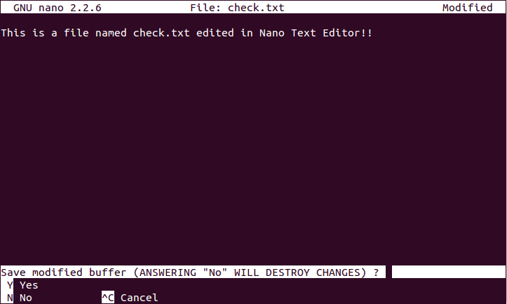

4. **sudo** — A widely used command in the Linux command line, **sudo** stands for "SuperUser Do". So, if you want any command to be done with administrative or root privileges, you can use the **sudo** command. For example, if you want to edit a file like **viz. alsa-base.conf**, which needs root permissions, you can use the command – **sudo nano alsa-base.conf**. You can enter the root command line using the command “**sudo bash**”, then type in your user password. You can also use the command “**su**” to do this, but you need to set a root password before that. For that, you can use the command “**sudo passwd**”(not misspelled, it is **passwd**). Then type in the new root password.
This command executes only that command with root/ superuser privileges.

**syntax:**

`sudo <command>`

    Command    Explanation
    sudo useradd <username>    
    
    Adding a new user
    sudo passwd <username>    Setting a password for the new user
    sudo userdel <username>     Deleting the user
    sudo groupadd <groupname>    Adding a new group
    sudo groupdel <groupname>     Deleting the  group
    sudo usermod -g <groupname> <username>    Adding a user to a primary group

5. **clear**

This command is used to clear the terminal screen. Contents will not actually be deleted in this case, only scrolled down. You can also clear the screen by pressing **Ctrl**+**L** on the keyboard.

**syntax**:

    clear

6. **du** — Use **du** to know the disk usage of a file in your system. If you want to know the disk usage for a particular folder or file in Linux, you can type in the command **df** and the name of the folder or file. For example, if you want to know the disk space used by the documents folder in Linux, you can use the command 

       du Documents

You can also use the command “**ls -lah**” to view the file sizes of all the files in a folder.

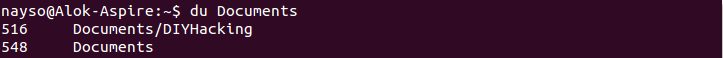

7. **tar** — Use tar to work with tarballs (or files compressed in a tarball archive) in the Linux command line. It has a long list of uses. It can be used to compress and uncompress different types of tar archives like **.tar, .tar.gz, .tar.bz2**,etc. It works on the basis of the arguments given to it. For example, "**tar -cvf**" for creating a .tar archive, **-xvf** to untar a tar archive, **-tvf** to list the contents of the archive, etc.

8. **zip, unzip** — Use **zip** to compress files into a zip archive, and **unzip** to extract files from a zip archive.

9. **uname** — Use uname to show the information about the system your Linux distro is running. Using the command “**uname -a**” prints most of the information about the system. This prints the kernel release date, version, processor type, etc.

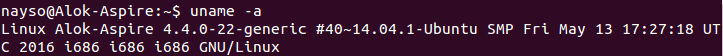

10. **apt-get** — Use **apt** to work with packages in the Linux command line. Use **apt-get** to install packages. This requires root privileges, so use the sudo command with it. For example, if you want to install the text editor **jed** (as I mentioned earlier), we can type in the command 

        sudo apt-get install jed

Similarly, any packages can be installed like this. It is good to update your repository each time you try to install a new package. You can do that by typing 

    sudo apt-get update

You can upgrade the system by typing 

    sudo apt-get upgrade
    
    We can also upgrade the distro by typing:
    sudo apt-get dist-upgrade

The command “**apt-cache search**” is used to search for a package. If you want to search for one, you can type in “**apt-cache search jed**”(this doesn't require root).

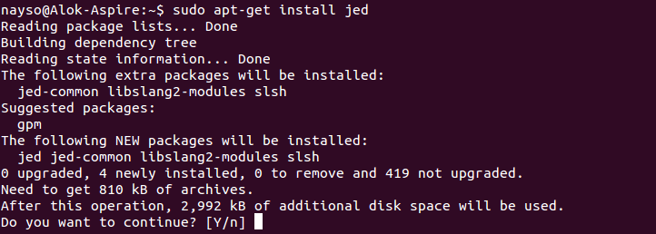

11. **chmod** — Use **chmod** to make a file executable and to change the permissions granted to it in Linux. Imagine you have a python code named numbers.py in your computer. You'll need to run “**python numbers.py**” every time you need to run it. Instead of that, when you make it executable, you'll just need to run “numbers.py” in the terminal to run the file. To make a file executable, you can use the command “chmod +x numbers.py” in this case. You can use “chmod 755 numbers.py” to give it root permissions or “sudo chmod +x numbers.py” for root executable. 
12. **pushd and popd** work according to the “LIFO” (last in, first out) principle. In this principle, only two operations are allowed: push an item into the stack, and pop an item out of the stack.
**pushd** adds a directory to the top of the stack and **popd** removes a directory from the top of the stack.
Alternatively, you can view the stack with the dirs command, and you can see the index number for each directory by using the -v option:

        $ dirs -v
        0  ~/one/two/three/four
        1  ~/one/two/three
        2  ~/one
        3  ~/one/two/three/four/five