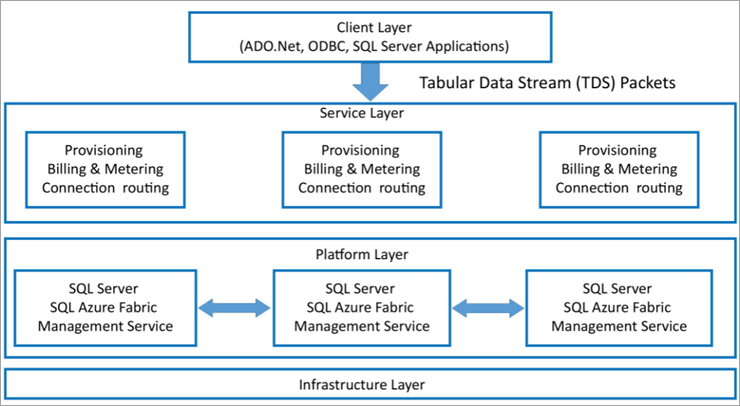

## Azure SQL
Azure SQL Database is a reliable, scalable Database as a Service (DaaS) that also has the capability of durability with fully automated AI-powered techniques.

Using DaaS we can host the database and develop the relational SQL database in the Azure cloud without the use of hardware or software installation. Azure SQL database enables the modern cloud application technique which has plenty of resources to support both the types of relational and non-relational data, for example, XML, graphs, and JSON.

In Azure cloud, we can create the database and run it within 5 minutes. We can also scale up and scale down the database as per the business requirements.
### Azure SQL Database Features
The features are:

* Upgrading and patching.
* Best long-term backup continuity
* Geographically distributed data networks
* Monitoring
* Develop high-performance data storage layer
* Support the non-relational data
* Fast performance using the AI-based Automatic tunic feature
* High-availability
* High-scalability using the database resources
* Automated techniques of the data backups
* Tremendous business continuity

### SQL Azure Database Architecture
Microsoft Azure SQL Database has the ability of scalability and also it is an extremely multi-tenant relational database service that is available on the cloud and performs as Platform-as-a-Service (PaaS) which facilitates the installation of the software, handles the patching, and maintains the servers at cloud platform level without the use of the software license key and versioning.

There are four layers in Azure SQL Architecture:

1. Client Layer
2. Service Layer
3. Platform Layer
4. Infrastructure Layer

Now, let us briefly understand each layer one by one.

**Client Layer**

It performs as the User Interface (UI) for applications to get the SQL Database, for transferring the data among the SQL Database and applications. Here we have the mechanism of Tabular Data Stream (TDS), which can easily communicate to the software applications with the. NET, ADO.NET technologies.

**Service Layer**

The next layer in the architecture is the service layer, which is in between the platform and the client layers, that acts as a doorway between the two. As you can see in the diagram, provisioning, billing, and routing connections come under this layer. It validates Microsoft Azure SQL Database requests and authenticates a user. Also, it establishes a connection between the client and the server and routes packets through this connection.

**Platform Layer**

Using the platform layer we can host the SQL database in the physical server and can use it in multiple physical servers. It also establishes the connection between the SQL database and can be used in the application.

This layer has systems (data nodes) that host the actual Azure SQL Server in the data center. Each SQL Database is stored in one of the nodes and is replicated twice across two different physical servers. Azure SQL makes sure that multiple copies of servers are kept within the Azure Cloud. It also ensures that the copies are synchronized when clients manipulate their data on them.

**Infrastructure Layer**

This is the first layer from the bottom of the architecture and is responsible for the administration of the OS and the physical hardware.

### Deployment Models for Running SQL Server
* **Single Database**
It is deployed to an Azure VM and operated with a SQL Database server. This is the primary deployment model.

* **Elastic pool**
It is a simple and cost-effective solution for scaling and managing more than one database. The databases inside an elastic pool are on a single Azure SQL Database server and share a group of resources at a fixed price.
We can configure resources for the pool based either on the DTU- based purchasing model or the vCore-based purchasing model.

The size of a pool always depends on the aggregate resource needed for all databases in the pool. It determines the following options:
1. The maximum resources utilized in the pool by the databases.
2. The maximum storage bytes utilized in the pool by the databases.

* **Managed Instance**
It is a fully operated database instance. It is intended to facilitate the smooth migration of on-premises SQL databases
**On-premises** means a software & a hardware infrastructural setup deployed & running from within the confines of your organization.

### Azure SQL Database service tiers
**General Purpose/ Standard model**

It is based on a separation of computing and storage service. This architectural model depends on the high availability and reliability of Azure Premium Storage that transparently copies database files and guarantees for zero data loss if underlying infrastructure failure happens.

**Business Critical/ Premium service tier model**

It is based on a cluster of database engine processes. Both the SQL database engine process and underlying mdf/ldf files are placed on the same node with locally attached SSD storage providing low latency to our workload. High availability is implemented using technology similar to SQL Server Always On Availability Groups.

**Hyperscale service tier model**

It is the newest service tier in the vCore-based purchasing model. This tier is a highly scalable storage and computes performance tier that leverages the Azure architecture to scale-out the storage and computes resources for an Azure SQL Database beyond the limits available for the General Purpose and Business Critical service tiers.

### Scaling Using Azure SQL Database
Microsoft Azure provides the dynamic scalability feature, and it enables your database to work as transparently. It provides manual scaling with the least downtime with the automotive Elastic pool technique, which allows the distribution of resources in a pool based on specific database needs.

It has inbuilt scripts which help the automated scalability for a single database in Azure SQL Database.

**Types of Scaling**

**Horizontal scaling**
It can add and remove the database to improve retention and performance, also described as “scaling out”.
**Vertical scaling**
Describes the increasing or decreasing the compute size of an original database, also is recognized as “scaling up.”

## Creating an Azure SQL Database using Azure portal

**Step 1**: Click on create a resource and search for SQL Database. Then click on create.

**Step 2**: Fill all the required details.

**Step 3**: Select a server or create a new one, as shown in the figure given below.

**Step 4**: Now, select the pricing tier by clicking on Compute + Storage, as shown in the figure below.

Allow the options in **Networking** to be at default.

Leave everything on default.

**Step 5**: After that, click on Review + Create and create the SQL database for your apps.

**Step 6**: Your SQL database is now created, now click on the go-to resources to configure additional settings for your database.

On your Overview, you would find various details of your database

## Connect to your database using the Query editor
**Step 1**: Select the `Query editor` found on the left side of the bar, and type in your password and click `OK`

Incase you have issues like "Client ip address not allowed" there will be an option for you to add the client ip to the firewall and immediately you click on it, the firewall will update the client ip address. Now, you can click `OK`
And you are in.

To create your table,

    create table books (
    std_id INT PRIMARY KEY,
    std_name VARCHAR(240) NOT NULL,
    std_course VARCHAR(240) NOT NULL,
    std_stream VARCHAR(240)
    );

To put values into you table,

    INSERT INTO books
    VALUES
    (1, 'Stan', 'Eng 201', 'mind'),
    (2, 'Chris', 'Maths 201', 'mind'),
    (3, 'Edu', 'Eng 202', 'mind');

To display the content of the table as well as the table,

    select * from [dbo].[books]

To update a table,

    update [dbo].[books] set std_name = 'jason' where std_id = 1