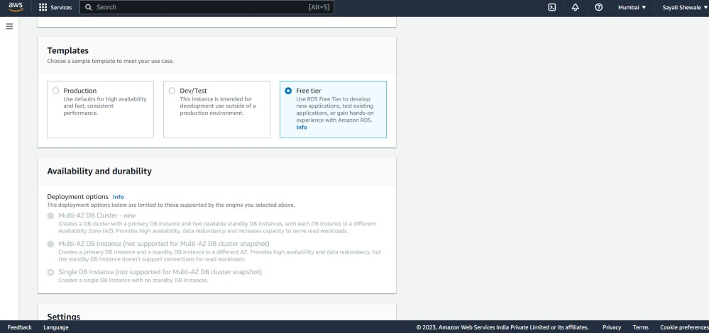
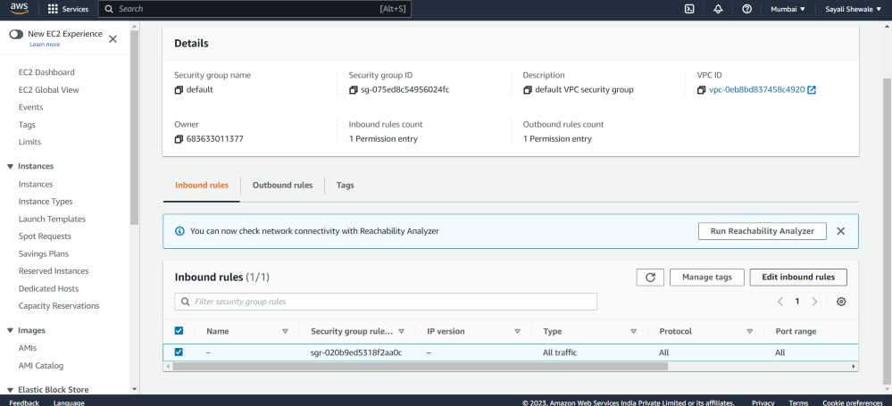

## Deploy Wordpress website on AWS using Apache2

As WordPress requires a MySQL database to store its data, create an RDS

Go to the Amazon RDS console. Click "Create database".

Select "MySQL" as the engine type.

Choose the "Free tier" template for "DB instance class".

Enter a unique name for the "DB instance identifier".

Set the "Master username" and "Master password" for the database.

Set the "Virtual Private Cloud (VPC)" and "Subnet group" to create the instance in. Leave the other settings at their default values.

Choose 'Default VPC'

Click on "create database"

Database is created.

#### To configure this WordPress site, you will create the following resources in AWS:
An Amazon EC2 instance to install and host the WordPress application.

Go to the Amazon EC2 console., Click "Launch Instance", Choose a Linux AMI.

Choose an instance type, such as t2.micro, Choose a VPC and subnet.

Configure security group rules to allow inbound traffic on the appropriate port for the type of database you are using (e.g. port 3306 for MySQL).

#### An Amazon RDS for MySQL database to store your WordPress data.
Choose the MySQL database you created, go to the Connectivity & security tab in the display and choose the security group listed in VPC security groups. The console will take you to the security group configured for your database.

Select the Inbound rules tab, then choose the Edit inbound rules button to change the rules for your security group.

Change the Type property to MYSQL/Aurora, which will update the Protocol and Port range to the proper values.

Choose the security group that you used for your EC2 instance.

SSH into your EC2 instance

run the following command in your terminal to install a MySQL client to interact with the database.

    sudo apt install mysql-client-core-8.8

Run the following command in your terminal to connect to your MySQL database. Replace “<user>” and “<password>” with the master username and password you configured when creating your Amazon RDS database. -h is host which is RDS database endpoint.

    mysql -h <rds-database-endpoint> -P <port-no> -u <user> -p <password>

Finally, create a database user for your WordPress application and give the user permission to access the wordpress database.

Run the following commands in your terminal:

    CREATE DATABASE wordpress;
    CREATE USER 'wordpress' IDENTIFIED BY 'wordpress-pass';
    GRANT ALL PRIVILEGES ON wordpress.* TO wordpress;
    FLUSH PRIVILEGES;
    Exit

you should use a better password than wordpress-pass to secure your database.

To run WordPress, you need to run a web server on your EC2 instance.

To install Apache on your EC2 instance, run the following command in your terminal:

    sudo apt-get install apache2

To start the Apache web server, run the following command in your terminal:

    systemctl restart apache2

You can see that your Apache web server is working by browsing public-ip of your ec2 instance.

#### Setup the server and post your new Wordpress app.
First, download and uncompressed the software by running the following commands in your terminal:

    wget https://wordpress.org/latest.tar.g
    tar -xzf latest.tar.gz

you will see a tar file and a directory called wordpress with the uncompressed contents using ls command.

Change the directory to the wordpress directory and create a copy of the default config file using the following commands

    open the wp-config.php file

Edit the database configuration by changing the following lines:

**DB_NAME**: your RDS database name

**DB_USER**: The name of the user you created in the database in the previous steps

**DB_PASSWORD**: The password for the user you created in the previous steps
**DB_HOST**: The hostname of the database means your database endpoint

The second configuration section you need to configure is the Authentication Unique Keys and Salts.

You can replace the entire content in that section with the below content:

    define('AUTH_KEY',         '@VZ<pXEL?vb-kiz(Zfp_R9f9|.+T-O/P$Z9|T-q%~|KX@,/(RZk00K{ybHA=6nT6')
    define('SECURE_AUTH_KEY',  '12Ip[Ts<IA>Vc+R#_X>i85OjMMRtks-o^E2(,$P[Q=f~Zt:@FrW1r$,` vqs|%@|');
    define('LOGGED_IN_KEY',    'o*_:obJ!+wtc8&]QhK}-xEVv+eVD!hFbBzkxKn@}(gK{-{d|l-?9b)8+)tfx8zjl');
    define('NONCE_KEY',        'Ue<fX0Z71vg7Y&F+~CqM-G%N~ozMe%?qrp-@|tTVh??zJ4:~Sm,VhTKBE0C7DY(?');
    define('AUTH_SALT',        'v.Z^1,QR66F-CDW=t<daxxk-;|M3cC{XzF`rn#l[U]f-fboHZYY/c8nvYU(uM`a]');
    define('SECURE_AUTH_SALT', 'Cz$[Mq>)Hc=BSo,&Q%;,r}Eu7!:>nj4N91WeIx|7jp=fc+S64lMXCNj|h&a9Q5[D');
    define('LOGGED_IN_SALT',   'Y{[of`B<!<<Za+|YtiMJkd33@a}+I%-0u}EPmAx?hW~$_(( u iuIJ2UQUJIv7(Q');
    define('NONCE_SALT',       'g<!-Nhqy2E{X{87!|x{Amg3v:Z%e8d(z3l9x|g-T uB62u4xuw?uyjS_>1Yl]~Kw');;

First, install the application dependencies you need for WordPress. In your terminal, run the following command.

    sudo apt install php libapache2-mod-php php-mysql -y

Copy your WordPress application files into the /var/www/html directory used by Apache.

    sudo cp -r wordpress/* /var/www/html/

Finally, restart the Apache web server

    systemctl restart apache2

Browse "ec2-public-ip/wp-admin/" you should see the WordPress welcome page.

