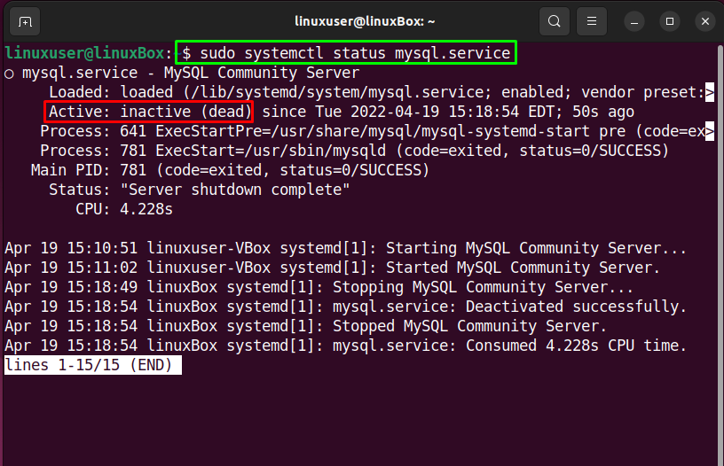

# How to Change MySQL Root Password in Ubuntu 20.04
## Step 1: Check the version of MySQL on Ubuntu 20.04
First of all, check the version of your MySQL because this post contains the solution of changing the root password on version 8 or higher. If the version of your MySQL is lower than 8, then the solution will be different. The command for checking the version of MySQL is given below:

    mysql --version

## Step 2: Stop the MySQL server
To change the MySQL root password, you first need to shut down the MySQL server, and you can do so using the command:

    sudo systemctl stop mysql.service

Check the status of the MySQL server to verify using the command:

    sudo systemctl status mysql.service

## Step 3: Skip Grant Tables & Networking
To start the MySQL server without granting the tables and networking check, set the environment variable “MYSQLD_OPTS” which MySQL uses on startup:

    sudo systemctl set-environment MYSQLD_OPTS="--skip-networking --skip-grant-tables"

Alright, the environment variable is set, and we can log in to the MySQL shell without providing any password.
## Step 4: Start the MySQL service
After setting the environment variable “MYSQLD_OPTS”, start the MySQL service now using the command:

    sudo systemctl start mysql.service

## Step 5: Confirm the status of the MySQL Server
Confirm the status of the MySQL service, whether it is running or not:

    sudo systemctl status mysql.service

## Step 6: Sign In to the MySQL shell
Now, you need to log in as a root user to the MySQL server and for signing in to the MySQL shell, type the command:

    sudo mysql -u root

Without providing any password, you will log in to the MySQL shell.
## Step 7: Alter the root password
Now, flush the privileges first:

    flush privileges;

Select the MySQL database:

    USE mysql

And set the new password for the root user using the ALTER command by typing the following statement:

    ALTER USER  'root'@'localhost' IDENTIFIED BY 'the-new-password';

At the place of “the-new-password” provide your new password. After successfully changing the MySQL root password, log out from the MySQL shell:

    quit;

## Step 8: Revert Database Server to Normal settings
For restarting the database server in “normal” mode, it is required to “revert” the changes we have made so that the networking is enabled and grant tables are loaded.

To do so, firstly unset the “MYSQLD_OPTS” environment variable which you have set previously:

    sudo systemctl unset-environment MYSQLD_OPTS

After doing so, remove the modified system configuration by reverting “MySQL”:

    sudo systemctl revert mysql

## Step 9: Kill all MySQL processes & Restart the MySQL service
Now, kill all the processes of MySQL before restarting the MySQL server:

    sudo killall -u mysql

After having the output as shown in the picture, hit “Enter” and restart the MySQL server using the command given below:

    sudo systemctl restart mysql.service

## Step 10: Log in with the newly set Password
Log in to the MySQL shell with the newly set password:

    sudo mysql -u root -p

Provide the recently set password in the ALTER command:

This is it. MySQL’s root password is successfully changed, and you are logged back into the MySQL shell.