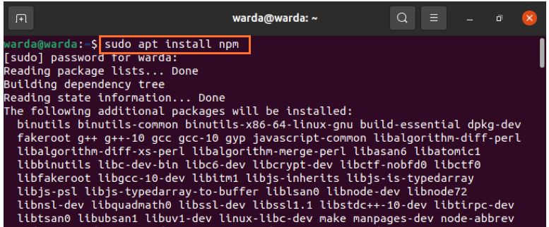
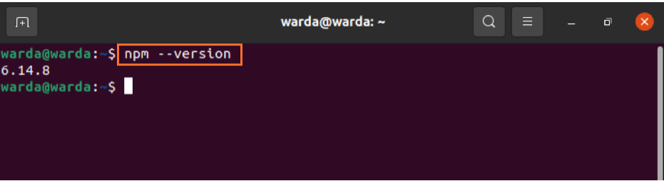
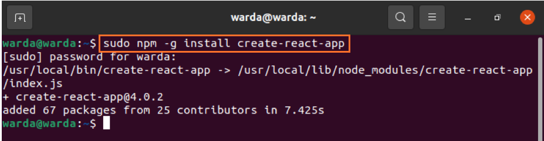
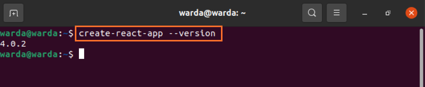
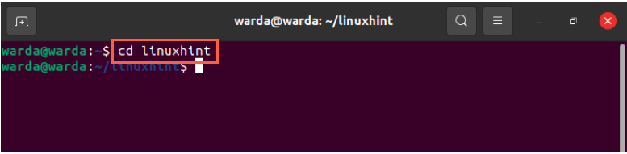
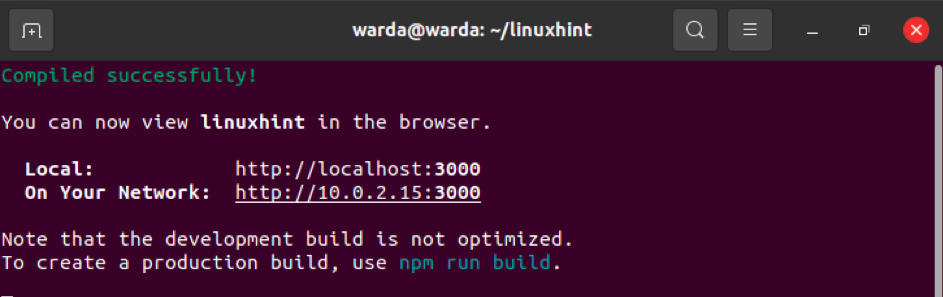
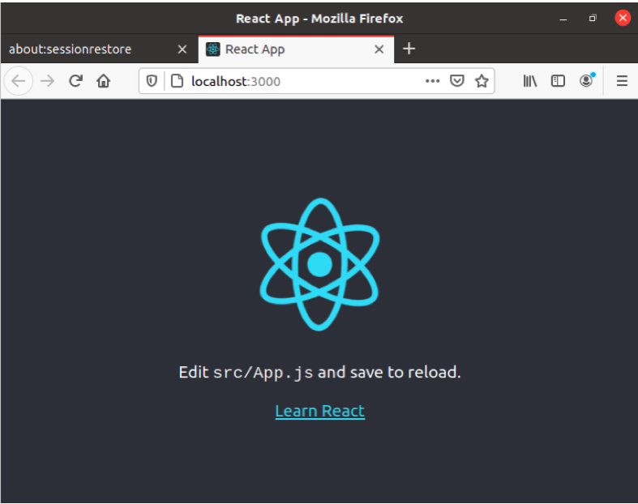

## How to install a React app
ReactJS is an open-source library that makes it effortless to create and maintain interactive UI specifically for single-page applications. Many developers are using it because of its flexibility, integrity, and its feature to bring Html directly into JS. Many well-known corporations such as Facebook, Uber, and Instagram used the ReactJS framework to create interfaces.

First, we need to install NPM, which is a dependency management tool containing all libraries. You can download any software package without login:

**Installing NPM**

To install npm, open up the terminal and type the following command:
* sudo apt install npm

To verify if the installation is completed successfully, check the npm version through the command:
* npm --version

The npm will also install the node library along. To confirm its version, type:
* node --version
install-reactjs-on-ubuntu-20.04-03](../../media/install-reactjs-on-ubuntu-20.04-03.png)
**Install Create-React-App tool**

Install create-react-app helps to set all tools required to create React Applications.

Run the following npm command to install the create-react-app utility:
* sudo npm -g install create-react-app

Check if the version is updated using the command:
* create-react-app --version

The downloading process has been completed. 

Now you can create React-Application.

I am giving the name of the application as “linuxhint”. Run the below-mentioned command to create an application:
* create-react-app linuxhint

After getting all packages, change the directory using:
* cd linuxhint

Now, to run react application named linuxhint, type mentioned command:
* npm start

You will get the following output:

And your browser will open-up and shows you that the app is up and running with local host-3000:
