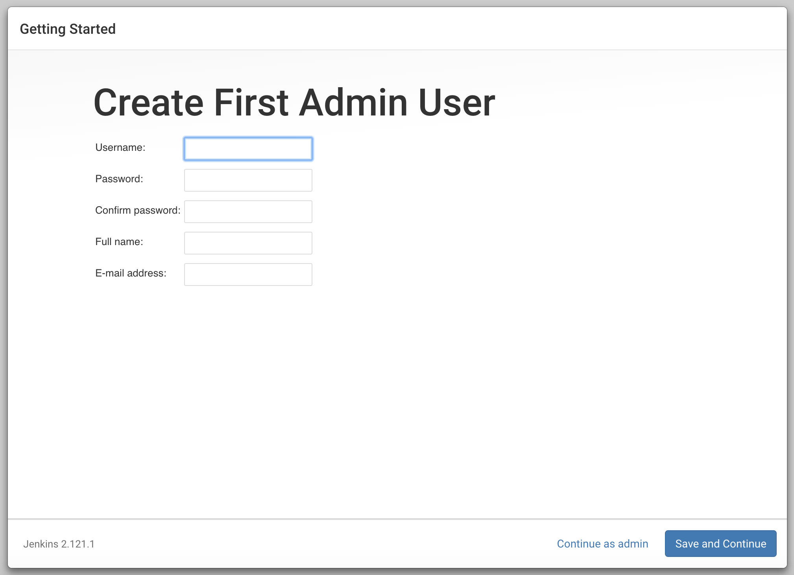

## Jenkins installation
### Installing the Default JRE/JDK

The easiest option for installing Java is to use the version packaged with Ubuntu. By default, Ubuntu 20.04 includes Open JDK 11, which is an open-source variant of the JRE and JDK.

To install this version, first update the package index:

    sudo apt update
    
Next, check if Java is already installed:

    java -version
    
If Java is not currently installed, you’ll see the following output:

    Output
    Command 'java' not found, but can be installed with:
    
    sudo apt install openjdk-11-jre-headless  # version 11.0.11+9-0ubuntu2~20.04, or
    sudo apt install default-jre              # version 2:1.11-72
    sudo apt install openjdk-13-jre-headless  # version 13.0.7+5-0ubuntu1~20.04
    sudo apt install openjdk-16-jre-headless  # version 16.0.1+9-1~20.04
    sudo apt install openjdk-8-jre-headless   # version 8u292-b10-0ubuntu1~20.04
    
Execute the following command to install the default Java Runtime Environment (JRE), which will install the JRE from OpenJDK 11:

    sudo apt install default-jre
    
The JRE will allow you to run almost all Java software.

Verify the installation with:

    java -version
You’ll see output similar to the following:

    Output
    openjdk version "11.0.11" 2021-04-20
    OpenJDK Runtime Environment (build 11.0.11+9-Ubuntu-0ubuntu2.20.04)
    OpenJDK 64-Bit Server VM (build 11.0.11+9-Ubuntu-0ubuntu2.20.04, mixed mode, sharing))
    
You may need the Java Development Kit (JDK) in addition to the JRE in order to compile and run some specific Java-based software. To install the JDK, execute the following command, which will also install the JRE:

    sudo apt install default-jdk
Verify that the JDK is installed by checking the version of javac, the Java compiler:

    javac -version
You’ll see the following output:

    Output
    javac 11.0.11

When faced with repetitive technical tasks, finding automation solutions that work can be a chore. With Jenkins, an open-source automation server, you can efficiently manage tasks from building to deploying software. Jenkins is Java-based, installed from Ubuntu packages or by downloading and running its web application archive (WAR) file — a collection of files that make up a complete web application to run on a server.
## Step 1 — Installing Jenkins

The version of Jenkins included with the default Ubuntu packages is often behind the latest available version from the project itself. To ensure you have the latest fixes and features, use the project-maintained packages to install Jenkins.

First, add the repository key to the system:

`wget -q -O - https://pkg.jenkins.io/debian-stable/jenkins.io.key | sudo apt-key add -`

After the key is added the system will return with `OK`.

Next, let’s append the Debian package repository address to the server’s `sources.list`:

`sudo sh -c 'echo deb http://pkg.jenkins.io/debian-stable binary/ > /etc/apt/sources.list.d/jenkins.list'`

  After both commands have been entered, we’ll run `update `so that`apt` will use the new repository.
  
`sudo apt update`

Finally, we’ll install Jenkins and its dependencies.

`sudo apt install jenkins`

Now that Jenkins and its dependencies are in place, we’ll start the Jenkins server.
## Step 2 — Starting Jenkins

Let’s start Jenkins by using `systemctl`:

`sudo systemctl start jenkins`

Since `systemctl` doesn’t display status output, we’ll use the `status` command to verify that Jenkins started successfully:

`sudo systemctl status jenkins`

If everything went well, the beginning of the status output shows that the service is active and configured to start at boot:

    Output
    ● jenkins.service - LSB: Start Jenkins at boot time
       Loaded: loaded (/etc/init.d/jenkins; generated)
       Active: active (exited) since Fri 2020-06-05 21:21:46 UTC; 45s ago
         Docs: man:systemd-sysv-generator(8)
        Tasks: 0 (limit: 1137)
       CGroup: /system.slice/jenkins.service

Now that Jenkins is up and running, let’s adjust our firewall rules so that we can reach it from a web browser to complete the initial setup.
## Step 3 — Opening the Firewall**

By default, Jenkins runs on port `8080`. We’ll open that port using `ufw`

`sudo ufw allow 8080`

Note: If the firewall is inactive, the following commands will allow OpenSSH and enable the firewall:

    sudo ufw allow OpenSSH
    sudo ufw enable

Check `ufw`’s status to confirm the new rules:

`sudo ufw status`

You’ll notice that traffic is allowed to port `8080` from anywhere:

    Output
    Status: active
    
    To                         Action      From
    --                         ------      ----
    OpenSSH                    ALLOW       Anywhere
    8080                       ALLOW       Anywhere
    OpenSSH (v6)               ALLOW       Anywhere (v6)
    8080 (v6)                  ALLOW       Anywhere (v6)

With Jenkins installed and our firewall configured, we can complete the installation stage and dive into Jenkins setup.
## Step 4 — Setting Up Jenkins**

To set up your installation, visit Jenkins on its default port, `8080`, using your server domain name or IP address: `http://your_server_ip_or_domain:8080`

You should receive the **Unlock Jenkins** screen, which displays the location of the initial password:

In the terminal window, use the `cat` command to display the password:

`sudo cat /var/lib/jenkins/secrets/initialAdminPassword`

Copy the 32-character alphanumeric password from the terminal and paste it into the **Administrator password** field, then click **`Continue**.

The next screen presents the option of installing suggested plugins or selecting specific plugins:

We’ll click the **Install suggested plugins** option, which will immediately begin the installation process.

When the installation is complete, you’ll be prompted to set up the first administrative user. It’s possible to skip this step and continue as `admin` using the initial password we used above, but we’ll take a moment to create the user.

Enter the name and password for your user:

You’ll receive an **Instance Configuration** page that will ask you to confirm the preferred URL for your Jenkins instance. Confirm either the domain name for your server or your server’s IP address:

After confirming the appropriate information, click **Save and Finish**. You’ll receive a confirmation page confirming that “**Jenkins is Ready!**”:

Click Start using Jenkins to visit the main Jenkins dashboard:

At this point, you have completed a successful installation of Jenkins.